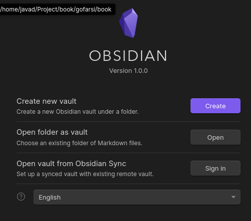
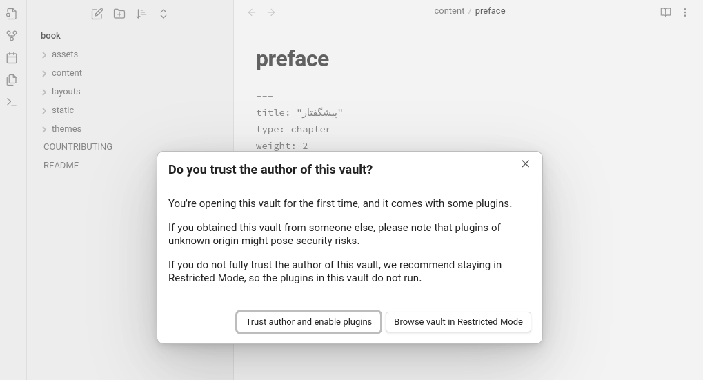

# مشارکت در کتاب آموزش گو فارسی

قبل شروع راهنمای مشارکت در این کتاب آموزشی از شما :heart: **قدردان و متشکر** :heart: هستیم که قصد دارید در بهبود و افزایش سطح دانش جامعه گوفرها کمک کنید.

## نحوه مشارکت
جهت مشارکت کافیه مراحل زیر را دنبال بفرمائید تا به راحتی بتوانید دانش/تجربه خود را برای توسعه/بهبود این کتاب به اشتراک بگذارید.

1. در ابتدا از مخزن [کتاب آموزش گو فارسی](https://github.com/GoFarsi/book) یک **fork** بگیرید.
2. سپس مخزن **fork** شده را در سیستم خود clone کنید.
3. اکنون نرم‌افزار [Obsidian](https://obsidian.md/) را جهت نوشتن آسان کتاب دانلود و نصب کنید.
4. پس از نصب نرم‌افزار Obsidian آن را اجرا کنید و طبق تصویر زیر گزینه **Open folder as vault** و روت پروژه fork شده در سیستم‌تان را انتخاب کنید.

5. پس از اینکه پروژه توسط Obsidian باز شد، با پیغامی مانند تصویر زیر مواجه خواهید شد و گزینه **Trust author and enable plugins** را انتخاب کنید تا نرم‌افزار با تنظیمات و پلاگین های مناسب اجرا شود.

>> قبل از شروع نوشتن یا بهبود بخشی باید توجه داشته باشید تمامی صفحات کتاب در مسیر **content** قرار دارد.

6. برای استفاده از ابزارهای قالب کتاب بهتر است [داکیومنت راهنما](https://github.com/GoFarsi/book/wiki/%D8%B1%D8%A7%D9%87%D9%86%D9%85%D8%A7%DB%8C-%D8%A7%D8%B3%D8%AA%D9%81%D8%A7%D8%AF%D9%87-%D8%A7%D8%B2-%D8%A7%D8%A8%D8%B2%D8%A7%D8%B1%D9%87%D8%A7-%D9%86%D9%88%D8%B4%D8%AA%D8%A7%D8%B1%DB%8C) را مطالعه فرمائید.
7. صفحه‌ای از کتاب را که تغییرات(هایی) ایجاد کردید، بهتر است توضیحات مناسبی در خصوص کامیت ارائه دهید تا بهتر بتوانیم درخواست Pull Request شما را بررسی کنیم.
8. در نهایت پس از ثبت کامیت‌ها، به شاخه **main** کتاب Pull Request کنید
9. به تاپیک [GoFarsi Book](https://t.me/GolangEngineers/3872) گروه Golang Engineer بپیوندید تا هماهنگ باشیم. 
