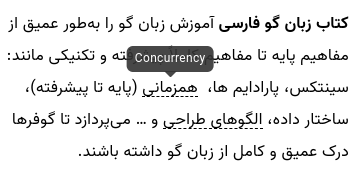
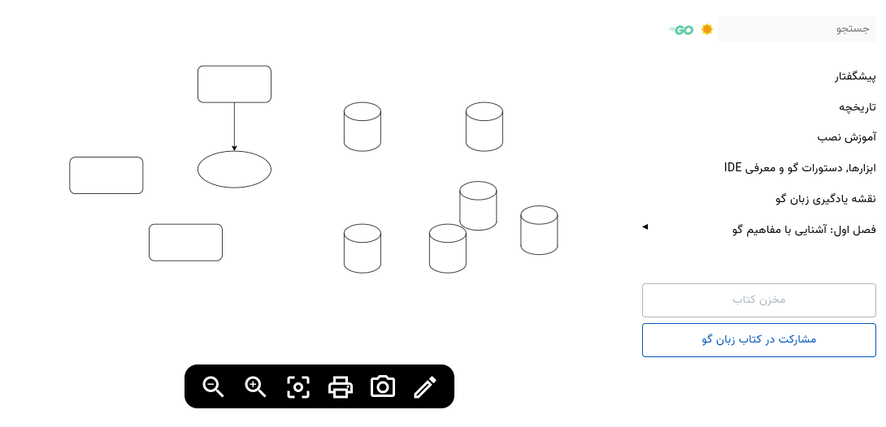
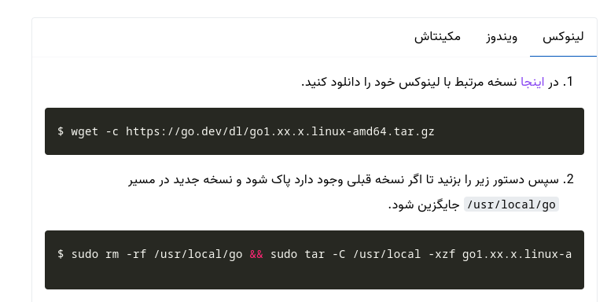
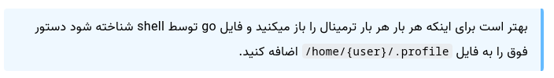
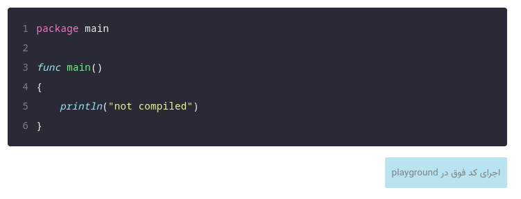

# آموزش استفاده از کدهای کوتاه در نوشتن کتاب

برای نوشتن کتاب شما می توانید از یکسری کدهای کوتاه (shortcodes) استفاده کنید که در زیر معرفی کردیم.

## کد کوتاه tooltip 



با استفاده از این کد کوتاه می توانید یک هاور متن برای کلمه مورد نظر خود ایجاد کنید.

```html
 
```

## کد کوتاه uml جهت اضافه کردن دیاگرام از سایت diagrams



با استفاده از کد کوتاه زیر می توانید uml های طراحی شده را به بخش های کتاب اضافه کنید :

1. در ابتدا وارد سایت [diagrams](https://app.diagrams.net/) شوید و یک نمونه دیاگرام طراحی کنید.
2. سپس به منو **File** بروید.
3. بخش **Embed** را باز کنید و گزینه **...IFrame** را بزنید.
4. در صفحه ای که اومد گزینه **Create** را بزنید.
5. در نهایت لینک **IFrame** را در فیلد **url** کد کوتاه کپی کنید.

```html
{{< uml url="https://viewer.diagrams.net/?tags=%7B%7D&highlight=0000ff&edit=_blank&layers=1&nav=1#R3ZdNb6MwEIZ%2FDcdKgAmQaxOaPXQ%2FpBwq7c3BUyA1GBkTYH%2F9mmBCSNpAd5smzQXZrweP52HGNhqaxeWC4zT8zghQzdRJqaG5Zpqu7cpnLVSNYDnTRgh4RBrJ6IRl9AeUqCs1jwhkPUPBGBVR2hd9liTgi56GOWdF3%2ByZ0b7XFAfKo94JSx9TODJ7iogIVVim0%2BnfIArC1rNhq%2Fhi3BqribMQE1bsScjT0IwzJppWXM6A1uxaLs17D2%2BM7hbGIRFjXnhk7Elf3U%2Fnz%2FqLl%2F0wdILJHWpm2WCaq4DVYkXVEgAigagu4yJkAUsw9Tr1nrM8IVC70WWvs5EeUykaUlyDEJX6ujgXTEqhiKkaPQ5FRZexnPtwYv1tSmAegDhhp8KqY9lzoEAtgMUgeCUNOFAsok3%2F42OVQ8HOrsMsG4r0O6gbw9Q7pjWgIowELFO8ZVHIQhvJbwNcQHkyYjWK2oJTdWpYql90WW%2B0qRzuZbytnwmSOSI1KZX7AAwD6tM8Ay7T%2FURcd4vfrl38Yg%2Bzcu65Jl2s3fWYnJI7UFo3%2FYpGEgdHw%2BBWDbjH1U7A%2FkuwxfkzF3IaUHrW1LYx2fE9gvkK8jf5TiYHfPVjvvYreN1z4R2RjV8Yr3VpvCPOoS%2BE155eGV7rpvA617Y5TG4Lr9XHi9CF8do3hdc9xOtcGK8zjPcfbqP%2FxcjQDyp8eunrlXt9kEw0fMp8FCTZ7f5Ut2N7v%2FvI%2Bws%3D" >}}
```

## کد کوتاه ایجاد Tab



با استفاده از کد کوتاه زیر می توانید تب ایجاد کنید برای کتاب.

```html


متن تست


متن تست ۲

```

## کد کوتاه hint



با استفاده از این کد کوتاه می توانید جعبه راهنما, هشدار و یا خطا نمایش دهید.

```html

متن تست

```

> سه نوع hint داریم می توانید از info , warning , error استفاده کنید.


## کد کوتاه playground



با استفاده از کد فوق می توانید دکمه اجرا کد در playground زبان گو اضافه کنید.

1. در ابتدا به سایت go.dev/play بروید.
2. سپس کد خود را در **playground** قرار دهید و تست بگیرید.
3. سپس دکمه **share** را بزنید تا آدرس کد ایجاد شود.
4. اکنون تگ داخل آدرس را در کد کوتاه زیر قرار دهید.

```html
https://go.dev/play/p/65lnwMCf_EV
```

```html

```