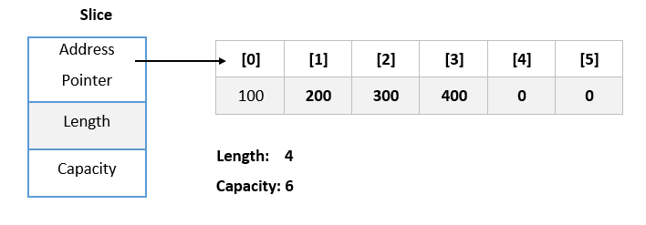
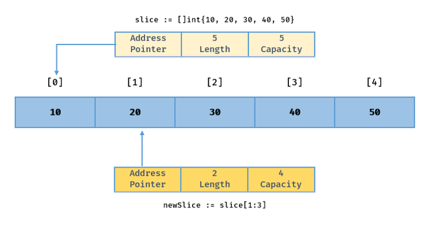

   و slice دو نوع تایپ با یک وجه اشتراک در زبان گو می باشند ولی این دو نوع تایپ یکسری تفاوت هایی با هم دارند که در ادامه به این دو تایپ می پردازیم.

## 1.8.1 تعریف آرایه

  یکی از عمومی ترین تایپ ها در زبان های برنامه نویسی می باشد که برای نگه داری گروهی مقادیر از یک نوع تایپ استفاده می شود.
برای دسترسی به هرکدام از مقادیر درون آرایه باید از   استفاده کرد.
معمولا برای آرایه شما تعداد مشخص و ثابتی را برای تعداد خانه های آرایه مشخص کنید که این آرایه قرار است چندتا مقدار نگه داری کند.

 

در زیر یک نمونه کد در خصوص   قرار دادیم :

```go
package main

import "fmt"

func main() {
	arrayInts := [5]int{1, 25, 12354, 654, 32}
	fmt.Println(arrayInts)
}
```

```shell
$ go run array.go
[1 25 12354 654 32]
```



1. یک متغیر کوتاه از نوع آرایه با نام **arrayInts** تعریف کردیم.
2. ظرفیت آرایه را با عدد **۵** تعیین کردیم (یعنی این آرایه فقط ۵ تا مقدار بیشتر نگه داری نمی کند)
3. سپس تایپ آرایه را از نوع **int** مشخص کردیم.
4. در نهایت در همانجا آرایه را مقدار دهی کردیم.


## 1.8.2 مفهوم اندازه و ظرفیت (size, capacity)

در آرایه ما ۲ تا مفهوم داریم اندازه و ظرفیت که از عنوان این مفهوم مشخص است آرایه دارای یک اندازه و ظرفیت مشخصی می باشد و اگر شما بیشتر از ظرفیت و اندازه تعیین شده مقدار دهی کنید با خطا مواجه خواهید شد.


در آرایه ظرفیت به نسبت اندازه تعیین می شود.


```go
package main

import "fmt"

func main() {
	arrayString := [3]string{"a", "b", "c", "d"}
	fmt.Println(arrayString)
}
```

```shell
$ go run array.go
./prog.go:6:42: index 3 is out of bounds (>= 3)
```



در کد فوق ما یک آرایه با اندازه ۳ تعریف کردیم و ۴ تا مقدار قرار دادیم و پس اجرا با خطای تعداد مقادیر بیشتر از اندازه و ظرفیت می باشد مواجه شدیم.

### 1.8.2.1 تابع len و cap

برای آرایه و slice ما ۲ تا تابع داریم که می توانیم اندازه و ظرفیت یک آرایه یا slice را بگیریم.

- تابع **len** یکی از توابعی می باشد خیلی کاربردی و پراستفاده هنگام کار با آرایه یا slice می باشد که می توانید اندازه آرایه یا slice را بگیرید.
- تابع **cap** ظرفیت آرایه و slice را نمایش می دهد.

```go
package main

import "fmt"

func main() {
	arrayString := [3]string{"a", "b", "c"}
	fmt.Printf("array %v, len %d, cap %d", arrayString, len(arrayString), cap(arrayString))
}
```

```shell
$ go run main.go
array [a b c], len 3, cap 3
```



## 1.8.3 تعریف آرایه و مقدارهی

در زیر ما یک آرایه با مقدار پیش فرض و اندازه مشخص تعریف کردیم و قصد داریم در ادامه کد مقداردهی کنیم.

```go
package main

import "fmt"

func main() {
	nums := [5]int{}
	fmt.Printf("array nums values %v, len %d, cap %d", nums, len(nums), cap(nums))

	nums[0] = 1
	nums[1] = 2
	nums[2] = 10
	nums[4] = 999
	
	fmt.Println("")
	fmt.Printf("array nums values %v, len %d, cap %d", nums, len(nums), cap(nums))
}
```

```shell
$ go run main.go
array nums values [0 0 0 0 0], len 5, cap 5
array nums values [1 2 10 0 999], len 5, cap 5
```



 

1. در کد فوق در ابتدا ما یک آرایه بدون مقدار تعریف کردیم.
2. سپس با استفاده از   مقدار را خانه مشخص قرار دادیم.


### 1.8.3.1 تعریف آرایه با اندازه تعیین شده توسط کامپایلر

شما در زبان گو می توانید با استفاده از `...`  یک آرایه با اندازه مشخص شده توسط کامپایلر تعریف کنید.

```go
package main

import "fmt"

func main() {
	nums := [...]int{1, 25, 45, 8797, 78, 879, 541, 11}
	fmt.Printf("array nums values %v, len %d, cap %d", nums, len(nums), cap(nums))
}
```

```shell
$ go run main.go
array nums values [1 25 45 8797 78 879 541 11], len 8, cap 8
```




توجه کنید زمانیکه `...` برای تعریف آرایه استفاده می کنید فقط در همان لحظه تعریف می توانید مقدار دهی کنید.


### 1.8.3.2 تعریف آرایه دوبعدی یا چندبعدی

در زبان گو همانند سایر زبان ها می توانید آرایه دوبعدی یا چند بعدی تعریف کنید که این برای پیاده سازی ماتریس یا یکسری سناریوهای توسعه کاربردی می باشد.

```go
package main

import "fmt"

func main() {
	nums := [2][2][2]int{{{1, 2}, {2, 3}}, {{4, 5}, {6, 7}}}
	fmt.Printf("array nums values %v, len %d, cap %d", nums, len(nums), cap(nums))
}
```

```shell
$ go run main.go
array nums values [[[1 2] [2 3]] [[4 5] [6 7]]], len 2, cap 2
```



 

### 1.8.3.3 مقایسه آرایه ها

در کد زیر ما یک نمونه مقایسه آرایه ها قرار دادیم که این مقایسه براساس تایپ, اندازه و مقادیر در نظر گرفته می شود.

```go
package main

import "fmt"

func main() {
	nums := [2]int{1, 2}
	nums2 := [2]int{1, 3}
	nums3 := [2]int{1, 2}
	nums4 := [3]int{1, 2, 3}
	chars := [2]string{"a", "b"}

	fmt.Println(nums == nums2) // false
	fmt.Println(nums == nums3) // true
	fmt.Println(nums == nums4) // error: invalid operation: nums == nums4 (mismatched types [2]int and [3]int)
	fmt.Println(nums == chars) // error: invalid operation: nums == chars (mismatched types [2]int and [2]string)
}

```



## 1.8.4 برش (slice)
همانطور که می دانید آرایه یک از مهم ترین عناوین در زبان های برنامه نویسی می باشد. اما در زبان گو slice به نسبت آرایه خیلی پراستفاده کاربردی است. اگر بخواهیم خیلی ساده slice را توصیف کنیم در واقع "یک slice به عنوان یک بخش بهم پیوسته از یک آرایه تعریف می شود که شما می توانید المنت هایش را در حال اجرا افزایش یا کاهش دهید بدون آنکه ظرفیت و اندازه آن را مشخص کنید."

اما این سوال پیش می آید علت اینکه slice به نسبت آرایه کاربردی هست چیست؟ آرایه دارای برخی از محدودیت ها علی الخصوص اندازه ثابت می باشد اما در slice شما این محدودیت ها را نخواهید داشت و خیلی ساده  می توانید المنت ها را افزایش, حذف و حتی کپی کنید.


در زبان گو slice ها یک پارچگی آرایه را حفظ می کند و کار با آرایه خیلی ساده و آسان تر خواهد شد.



 

### 1.8.4.1 تعریف یک slice با اندازه مشخص
شما می توانید با استفاده از تابع `make` یک slice با اندازه مشخص تعریف کنید.

 

```go
slice := make([]int, 5)

fmt.Println(len(slice)) // Print 5

fmt.Println(cap(slice)) // Print 5
```

### 1.8.4.2 تعریف یک slice با اندازه و ظرفیت مشخص

شما می توانید با استفاده از تابع `make` یک slice با ظرفیت و اندازه مشخصی تعریف کنید.

 

```go
slice := make([]int, 3, 5)

fmt.Println(len(slice)) // Print 3

fmt.Println(cap(slice)) // Print 5
```


توجه کنید مقدار ظرفیت نباید کمتر از مقدار اندازه باشد.

```go
package main

import "fmt"

func main() {
	test := make([]int, 5, 4)
	fmt.Println(test)
}
```

```shell
$ go run main.go
./main.go:6:22: invalid argument: length and capacity swapped
```



### 1.8.4.3 تعریف یک slice با متغیر کوتاه

شما خیلی ساده می توانید یک slice را توسط متغیر کوتاه ایجاد کنید.

```go
slice := []string{"Red", "Blue", "Green", "Yellow", "Pink"}

fmt.Println(len(slice)) //Print 5

fmt.Println(cap(slice)) //Print 5

intSlice:= []int{10, 20, 30}

fmt.Println(len(intSlice)) //Print 3

fmt.Println(cap(intSlice)) //Print 3
```

### 1.8.4.4 تعریف یک slice با موقعیت های شاخص

شما می توانید یک slice را با موقعیت های شاخص ایجاد کنید که n تا المنت با مقدار پیش فرض ایجاد می کند و در آخر x را به آخر slice اضافه می کند.

```go
package main

import "fmt"

func main() {
	test := []int{99: 88}
	fmt.Println(len(test), cap(test))
}
```

 
### 1.8.4.5 تعریف یک slice خالی

شما می توانید خیلی ساده یک slice خالی ایجاد کنید.

```go
sliceOne := make([]int, 0)

sliceTwo := []int{}

fmt.Println(sliceOne == nil) // print false

fmt.Println(len(sliceOne)) // print 0

fmt.Println(cap(sliceOne)) // print 0

fmt.Println(sliceTwo == nil) // print false

fmt.Println(len(sliceTwo)) // print 0

fmt.Println(cap(sliceTwo)) // print 0
```

 

## 1.8.5 مقدار دهی مجدد یکی از المنت های slice یا آرایه
شما خیلی راحت می توانید مقدار یکی از المنت های slice یا آرایه را مقدار دهی کنید.

```go
slice := []int{10, 20, 30, 40}

fmt.Println(slice) //print [10 20 30 40]

slice[1] = 25 

fmt.Println(slice) // print [10 25 30 40]
```

 

## 1.8.6 ایجاد یک slice جدید براساس یک slice از پیش تعریف شده

شما می توانید یک slice جدید را براساس یک slice از پیش تعریف شده تعریف کنید.

```go
x := []int{10, 20, 30, 40, 50}

fmt.Println(x) // Print [10 20 30 40 50]

fmt.Println(len(x)) // Print 5

fmt.Println(cap(x)) // Print 5

y := x[1:3]

fmt.Println(y) //Print [20 30]

fmt.Println(len(y)) //Print 2

fmt.Println(cap(y)) //Print 4
```


 

- ما یک x با ۵ تا المنت مقدار دهی شده تعریف کردیم.
- سپس یک متغیر کوتاه با نام y تعریف کردیم که متغیر x را با داخلش قرار دادیم.
- سپس برای x گفتم المنت های از اندیس ۱ تا ۳ را به y دسترسی دهد.



توجه کنید اتفاقی در بالا رخ داد ما تعیین اندیس اندازه و ظرفیت جدید برای y تعیین کردیم.

Len: 3 - 1 = 2
Cap: 5 - 1 = 4


## 1.8.7 خطای index out of range در slice

یک slice فقط با توجه به اندازه و اندیس هاش امکان دسترسی و مقدار دهی مجدد المنت هایش می باشد اما اگر شما خارج از اندازه تعیین شده تلاش کنید جهت مقدار دهی با خطای index out of range مواجه خواهید شد.

```go
package main

import "fmt"

func main() {
	slice := []int{10, 20, 30, 40, 50}
	newSlice := slice[1:3]
	newSlice[3] = 45
	fmt.Println(newSlice)
}
```

```shell
$ go run main.go
panic: runtime error: index out of range [3] with length 2

goroutine 1 [running]:
main.main()
	/tmp/sandbox548843089/prog.go:8 +0x5b
```

## 1.8.8 گسترش (append) المنت های یک slice
شما خیلی ساده می توانید با استفاده از `append` المنت های یک slice را گسترش دهید.

```go
slice := []int{10, 20, 30, 40, 50}

newSlice := slice[1:3]

fmt.Println(len(newSlice)) // Print 2

fmt.Println(cap(newSlice)) // Print 4

newSlice = append(newSlice, 60)

fmt.Println(len(newSlice)) // Print 3

fmt.Println(cap(newSlice)) // Print 4
```


 



در کد زیر اتفاقی که صورت گرفته شما اگر `...` را بعد از کلمه slice بزارید یعنی دارید میگید تمامی المنت های داخل slice به newSlice اضافه شود.

```go
slice := []int{10, 20, 30, 40, 50}

newSlice := append(newSlice, slice...)
```


## 1.8.9 نحوه حذف یک المنت در slice

برای حذف یک المنت در slice باید بصورت تکنیکی اینکار را انجام دهید چون زبان گو یک روش built-in برای اینکار ندارد.


 

- در این روش شما باید در ابتدا آخرین المنت را به المنت مورد نظر با استفاده از اندیس کپی کنید.
- سپس آخرین المنت را از slice حذف کنید.

```go
package main

import "fmt"

func main() {
	slice := []int{10, 20, 30, 40, 50}
	slice[1] = slice[len(slice)-1]
	slice = slice[:len(slice)-1]
	fmt.Println(slice)
}
```


## 1.8.10 تابع copy در slice
شما با استفاده از تابع `copy` می توانید یک slice را به slice دیگری کپی کنید.

```go
package main

import "fmt"

func main() {
	src := []int{1, 2, 3, 4, 5}
	dst := make([]int, 5)
	numberOfElementsCopied := copy(dst, src)
	fmt.Println(numberOfElementsCopied, dst)
}
```

```shell
$ go run main.go
5 [1 2 3 4 5]
```


## 1.8.11 نحوه مرتب کردن (sort) یک slice

برای مرتب کردن یک slice می توانید از توابع کتابخانه sort در زبان گو استفاده کنید.

- `sort.Ints`
- `sort.Float64s`
- `sort.Strings`

```go
package main

import (
	"fmt"
	"sort"
)

func main() {
	s := []int{4, 2, 3, 1}
	sort.Ints(s)
	fmt.Println(s)
}
```

```shell
$ go run main.go
[1 2 3 4]
```


## 1.8.12 فرق بین آرایه و slice

1. فرق نوع تعریف آرایه و slice
	- برای تعریف آرایه شما باید داخل براکت [] یک مقداری را قرار دهید.
	- برای تعریف slice هیچ مقداری داخل براکت [] هیچ مقداری نباید قرار دهید.

```go
array := [3]int{10, 20, 30}

slice := []int{10, 20, 30}
```

2. فرق بین  آرایه و slice
	- مقدار خالی بودن یک slice هست 
	- مقدار خالی یک آرایه, همان آرایه با المنت های مقدار پیش فرض می باشد.

```go
var slice []int32
var array [2]int32

fmt.Println(slice == nil) // print true
fmt.Println(len(slice)) // print 0
fmt.Println(cap(slice)) // print 0

fmt.Println(array) // print [0 0]

```
