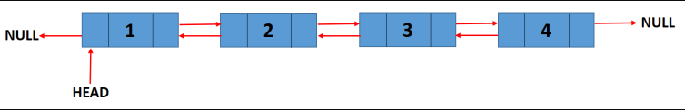

در این قسمت به بررسی مواردی مهم از ساختمان داده در زبان گو می‌پردازیم و این آموزش مناسب افرادی هست که با مباحث ساختمان داده آشنایی داشته باشند.

## 10.1.1  Queue in Golang 

یک صف (queue) ساده را می توان با استفاده از GO به کمک موارد زیر پیاده سازی کرد:
1. container/list package
2. slice

یک صف عملیات زیر را انجام می‌دهد:

1. Enqueue
2. Dequeue
3. Front
4. Size
5. Empty

###  10.1.1.1   **List Implementation**

پیاده سازی صف به کمک لیست‌ها

```go
package main

import (
    "container/list"
    "fmt"
)

type customQueue struct {
    queue *list.List
}

func (c *customQueue) Enqueue(value string) {
    c.queue.PushBack(value)
}

func (c *customQueue) Dequeue() error {
    if c.queue.Len() > 0 {
        ele := c.queue.Front()
        c.queue.Remove(ele)
    }
    return fmt.Errorf("Pop Error: Queue is empty")
}

func (c *customQueue) Front() (string, error) {
    if c.queue.Len() > 0 {
        if val, ok := c.queue.Front().Value.(string); ok {
            return val, nil
        }
        return "", fmt.Errorf("Peep Error: Queue Datatype is incorrect")
    }
    return "", fmt.Errorf("Peep Error: Queue is empty")
}

func (c *customQueue) Size() int {
    return c.queue.Len()
}

func (c *customQueue) Empty() bool {
    return c.queue.Len() == 0
}

func main() {
    customQueue := &customQueue{
        queue: list.New(),
    }
    fmt.Printf("Enqueue: A\n")
    customQueue.Enqueue("A")
    fmt.Printf("Enqueue: B\n")
    customQueue.Enqueue("B")
    fmt.Printf("Size: %d\n", customQueue.Size())
    for customQueue.Size() > 0 {
        frontVal, _ := customQueue.Front()
        fmt.Printf("Front: %s\n", frontVal)
        fmt.Printf("Dequeue: %s\n", frontVal)
        customQueue.Dequeue()
    }
    fmt.Printf("Size: %d\n", customQueue.Size())
}
```

خروجی برنامه بالا:

``` shell
Enqueue: A
Enqueue: B
Size: 2
Front: A
Dequeue: A
Front: B
Dequeue: B
Size: 0
```


###  10.1.1.2  **Slice Implementation**

پیاده سازی  صف به کمک slice

```go
package main

import (
	"fmt"
	"sync"
)

type customQueue struct {
	queue []string
	lock  sync.RWMutex
}

func (c *customQueue) Enqueue(name string) {
	c.lock.Lock()
	defer c.lock.Unlock()
	c.queue = append(c.queue, name)
}

func (c *customQueue) Dequeue() error {
	if len(c.queue) > 0 {
		c.lock.Lock()
		defer c.lock.Unlock()
		c.queue = c.queue[1:]
		return nil
	}
	return fmt.Errorf("Pop Error: Queue is empty")
}

func (c *customQueue) Front() (string, error) {
	if len(c.queue) > 0 {
		c.lock.Lock()
		defer c.lock.Unlock()
		return c.queue[0], nil
	}
	return "", fmt.Errorf("Peep Error: Queue is empty")
}

func (c *customQueue) Size() int {
	return len(c.queue)
}

func (c *customQueue) Empty() bool {
	return len(c.queue) == 0
}

func main() {
	customQueue := &customQueue{
		queue: make([]string, 0),
	}

	fmt.Printf("Enqueue: A\n")
	customQueue.Enqueue("A")
	fmt.Printf("Enqueue: B\n")
	customQueue.Enqueue("B")
	fmt.Printf("Len: %d\n", customQueue.Size())

	for customQueue.Size() > 0 {
		frontVal, _ := customQueue.Front()
		fmt.Printf("Front: %s\n", frontVal)
		fmt.Printf("Dequeue: %s\n", frontVal)
		customQueue.Dequeue()
	}
	fmt.Printf("Len: %d\n", customQueue.Size())
}
```

خروجی برنامه بالا:

```none
Enqueue: A
Enqueue: B
Size: 2
Front: A
Dequeue: A
Front: B
Dequeue: B
Size: 0
```

## 10.1.2   Stack in Golang


یک پشته (Stack) ساده را می توان با استفاده از GO به کمک موارد زیر پیاده سازی کرد:
1. container/list package
2. slice

یک stack عملیات زیر را انجام می‌دهد:

1. Push
2. Pop
3. Front
4. Size
5. Empty

###  10.1.2.1   **List Implementation**

پیاده سازی پشته به کمک لیست‌ها

```go
package main

import (
    "container/list"
    "fmt"
)

type customStack struct {
    stack *list.List
}

func (c *customStack) Push(value string) {
    c.stack.PushFront(value)
}

func (c *customStack) Pop() error {
    if c.stack.Len() > 0 {
        ele := c.stack.Front()
        c.stack.Remove(ele)
    }
    return fmt.Errorf("Pop Error: Stack is empty")
}

func (c *customStack) Front() (string, error) {
    if c.stack.Len() > 0 {
        if val, ok := c.stack.Front().Value.(string); ok {
            return val, nil
        }
        return "", fmt.Errorf("Peep Error: Stack Datatype is incorrect")
    }
    return "", fmt.Errorf("Peep Error: Stack is empty")
}

func (c *customStack) Size() int {
    return c.stack.Len()
}

func (c *customStack) Empty() bool {
    return c.stack.Len() == 0
}

func main() {
    customStack := &customStack{
        stack: list.New(),
    }
    fmt.Printf("Push: A\n")
    customStack.Push("A")
    fmt.Printf("Push: B\n")
    customStack.Push("B")
    fmt.Printf("Size: %d\n", customStack.Size())
    for customStack.Size() > 0 {
        frontVal, _ := customStack.Front()
        fmt.Printf("Front: %s\n", frontVal)
        fmt.Printf("Pop: %s\n", frontVal)
        customStack.Pop()
    }
    fmt.Printf("Size: %d\n", customStack.Size())
}
```

خروجی برنامه بالا:

```go
Push: A
Push: B
Size: 2
Front: B
Pop: B
Front: A
Pop: A
Size: 0
```


###  10.1.2.2   **Slice Implementation**

پیاده سازی  پشته به کمک slice

```go
package main

import (
    "fmt"
    "sync"
)

type customStack struct {
    stack []string
    lock  sync.RWMutex
}

func (c *customStack) Push(name string) {
    c.lock.Lock()
    defer c.lock.Unlock()
    c.stack = append(c.stack, name)
}

func (c *customStack) Pop() error {
    len := len(c.stack)
    if len > 0 {
        c.lock.Lock()
        defer c.lock.Unlock()
        c.stack = c.stack[:len-1]
        return nil
    }
    return fmt.Errorf("Pop Error: Stack is empty")
}

func (c *customStack) Front() (string, error) {
    len := len(c.stack)
    if len > 0 {
        c.lock.Lock()
        defer c.lock.Unlock()
        return c.stack[len-1], nil
    }
    return "", fmt.Errorf("Peep Error: Stack is empty")
}

func (c *customStack) Size() int {
    return len(c.stack)
}

func (c *customStack) Empty() bool {
    return len(c.stack) == 0
}

func main() {
    customStack := &customStack{
        stack: make([]string, 0),
    }
    fmt.Printf("Push: A\n")
    customStack.Push("A")
    fmt.Printf("Push: B\n")
    customStack.Push("B")
    fmt.Printf("Size: %d\n", customStack.Size())
    for customStack.Size() > 0 {
        frontVal, _ := customStack.Front()
        fmt.Printf("Front: %s\n", frontVal)
        fmt.Printf("Pop: %s\n", frontVal)
        customStack.Pop()
    }
    fmt.Printf("Size: %d\n", customStack.Size())
}
```

خروجی برنامه بالا:

```go
Push: A
Push: B
Size: 2
Front: B
Pop: B
Front: A
Pop: A
Size: 0
```


## 10.1.3  Set implementation in Golang

مجموعه (set) یک ساختار داده ای است که عناصر را بدون نظم خاصی در خود نگه می دارد. یک عنصر فقط یک بار در یک مجموعه ظاهر می شود.  
  
Set را می توان با استفاده از map در GO پیاده سازی کرد. ما از map[string]struct{} برای مجموعه استفاده خواهیم کرد زیرا **struct{}** هیچ حافظه ای اشغال نمی کند، بنابراین از نظر ذخیره سازی کارآمدتر است.  
در زیر مثال ساده مجموعه (set) که دارای عملیات زیر است را داریم:

1. Add
2. Remove
3. Exists

```go
package main

import (
    "fmt"
)

//MakeSet initialize the set
func makeSet() *customSet {
    return &customSet{
        container: make(map[string]struct{}),
    }
}

type customSet struct {
    container map[string]struct{}
}

func (c *customSet) Exists(key string) bool {
    _, exists := c.container[key]
    return exists
}

func (c *customSet) Add(key string) {
    c.container[key] = struct{}{}
}

func (c *customSet) Remove(key string) error {
    _, exists := c.container[key]
    if !exists {
        return fmt.Errorf("Remove Error: Item doesn't exist in set")
    }
    delete(c.container, key)
    return nil
}

func (c *customSet) Size() int {
    return len(c.container)
}

func main() {
    customSet := makeSet()
    fmt.Printf("Add: B\n")
    customSet.Add("A")
    fmt.Printf("Add: B\n")
    customSet.Add("B")
    fmt.Printf("Size: %d\n", customSet.Size())
    fmt.Printf("A Exists?: %t\n", customSet.Exists("A"))
    fmt.Printf("B Exists?: %t\n", customSet.Exists("B"))
    fmt.Printf("C Exists?: %t\n", customSet.Exists("C"))
    fmt.Printf("Remove: B\n")
    customSet.Remove("B")
    fmt.Printf("B Exists?: %t\n", customSet.Exists("B"))
}
```

خروجی برنامه بالا:

```go
Add: B
Add: B
Size: 2
A Exists?: true
B Exists?: true
C Exists?: false
Remove: B
B Exists?: false
```


## 10.1.4  Linked List  in Golang

لیست منفرد یک نوع ساده از لیست پیوندی است که امکان پیمایش در یک جهت یعنی جلو را فراهم می کند. هر گره در لیست پیوندی شامل بخش داده و اشاره گر به گره بعدی در لیست پیوند شده است.

لیست پیوندی اجرا شده در مثال زیر از عملیات زیر پشتیبانی می کند.

1. AddFront
2. AddBack
3. RemoveFront
4. RemoveBack
5. Traverse
6. Front
7. Size

```go
package main

import "fmt"

type ele struct {
    name string
    next *ele
}

type singleList struct {
    len  int
    head *ele
}

func initList() *singleList {
    return &singleList{}
}

func (s *singleList) AddFront(name string) {
    ele := &ele{
        name: name,
    }
    if s.head == nil {
        s.head = ele
    } else {
        ele.next = s.head
        s.head = ele
    }
    s.len++
    return
}

func (s *singleList) AddBack(name string) {
    ele := &ele{
        name: name,
    }
    if s.head == nil {
        s.head = ele
    } else {
        current := s.head
        for current.next != nil {
            current = current.next
        }
        current.next = ele
    }
    s.len++
    return
}

func (s *singleList) RemoveFront() error {
    if s.head == nil {
        return fmt.Errorf("List is empty")
    }
    s.head = s.head.next
    s.len--
    return nil
}

func (s *singleList) RemoveBack() error {
    if s.head == nil {
        return fmt.Errorf("removeBack: List is empty")
    }
    var prev *ele
    current := s.head
    for current.next != nil {
        prev = current
        current = current.next
    }
    if prev != nil {
        prev.next = nil
    } else {
        s.head = nil
    }
    s.len--
    return nil
}

func (s *singleList) Front() (string, error) {
    if s.head == nil {
        return "", fmt.Errorf("Single List is empty")
    }
    return s.head.name, nil
}

func (s *singleList) Size() int {
    return s.len
}

func (s *singleList) Traverse() error {
    if s.head == nil {
        return fmt.Errorf("TranverseError: List is empty")
    }
    current := s.head
    for current != nil {
        fmt.Println(current.name)
        current = current.next
    }
    return nil
}

func main() {
     singleList := initList()
    fmt.Printf("AddFront: A\n")
    singleList.AddFront("A")
    fmt.Printf("AddFront: B\n")
    singleList.AddFront("B")
    fmt.Printf("AddBack: C\n")
    singleList.AddBack("C")

    fmt.Printf("Size: %d\n", singleList.Size())
   
    err := singleList.Traverse()
    if err != nil {
        fmt.Println(err.Error())
    }
    
    fmt.Printf("RemoveFront\n")
    err = singleList.RemoveFront()
    if err != nil {
        fmt.Printf("RemoveFront Error: %s\n", err.Error())
    }
    
    fmt.Printf("RemoveBack\n")
    err = singleList.RemoveBack()
    if err != nil {
        fmt.Printf("RemoveBack Error: %s\n", err.Error())
    }
    
    fmt.Printf("RemoveBack\n")
    err = singleList.RemoveBack()
    if err != nil {
        fmt.Printf("RemoveBack Error: %s\n", err.Error())
    }
    
    fmt.Printf("RemoveBack\n")
    err = singleList.RemoveBack()
    if err != nil {
        fmt.Printf("RemoveBack Error: %s\n", err.Error())
    }
    
    err = singleList.Traverse()
    if err != nil {
        fmt.Println(err.Error())
    }
    
   fmt.Printf("Size: %d\n", singleList.Size())
}
```


خروجی برنامه بالا:

```shell
AddFront: A
AddFront: B
AddBack: C
Size: 3
B
A
C
RemoveFront
RemoveBack
RemoveBack
RemoveBack
RemoveBack Error: removeBack: List is empty
TranverseError: List is empty
Size: 0
```

## 10.1.5  Doubly Linked List in Go

یک لیست مضاعف (Doubly Linked)  شامل سه قسمت در گره خود است.


- فیلد داده.
- یک اشاره گر بعدی به گره بعدی در لیست اشاره می کند.
- یک اشاره گر قبلی که به گره قبلی در لیست اشاره می کند.

در اینجا فیلدهای «داده‌ها» و «بعدی» مانند لیست‌های پیوندی منفرد هستند. فیلد اشاره گر «قبلی»  ویژگی جدیدی است که لیست پیوندی را به لیست پیوندی دوگانه تبدیل می کند.  

در زیر نمونه ای از یک لیست با پیوند دوگانه آورده شده است. اشاره گر قبلی گره head (start) به Null اشاره می کند. به طور مشابه، اشاره گر Next آخرین گره به Null اشاره می کند.

  
برای پیاده‌سازی یک  doubly linked list در زبان Go، یک ساختار گره با داده‌ها، اشاره‌گر قبلی و اشاره‌گر بعدی، روش‌هایی برای افزودن گره‌ها در  doubly linked list (از قسمت جلویی یا از انتهای هر دو) و روش‌هایی برای پیمایش به جلو/عقب ایجاد کنید. 


```go
package main

import "fmt"

type node struct {
	data string
	prev *node
	next *node
}

type doublyLinkedList struct {
	len  int
	tail *node
	head *node
}

func initDoublyList() *doublyLinkedList {
	return &doublyLinkedList{}
}

func (d *doublyLinkedList) AddFrontNodeDLL(data string) {
	newNode := &node{
		data: data,
	}
	if d.head == nil {
		d.head = newNode
		d.tail = newNode
	} else {
		newNode.next = d.head
		d.head.prev = newNode
		d.head = newNode
	}
	d.len++
	return
}

func (d *doublyLinkedList) AddEndNodeDLL(data string) {
	newNode := &node{
		data: data,
	}
	if d.head == nil {
		d.head = newNode
		d.tail = newNode
	} else {
		currentNode := d.head
		for currentNode.next != nil {
			currentNode = currentNode.next
		}
		newNode.prev = currentNode
		currentNode.next = newNode
		d.tail = newNode
	}
	d.len++
	return
}
func (d *doublyLinkedList) TraverseForward() error {
	if d.head == nil {
		return fmt.Errorf("TraverseError: List is empty")
	}
	temp := d.head
	for temp != nil {
		fmt.Printf("value = %v, prev = %v, next = %v\n", temp.data, temp.prev, temp.next)
		temp = temp.next
	}
	fmt.Println()
	return nil
}

func (d *doublyLinkedList) TraverseReverse() error {
	if d.head == nil {
		return fmt.Errorf("TraverseError: List is empty")
	}
	temp := d.tail
	for temp != nil {
		fmt.Printf("value = %v, prev = %v, next = %v\n", temp.data, temp.prev, temp.next)
		temp = temp.prev
	}
	fmt.Println()
	return nil
}

func (d *doublyLinkedList) Size() int {
	return d.len
}
func main() {
	doublyList := initDoublyList()
	fmt.Printf("Add Front Node: C\n")
	doublyList.AddFrontNodeDLL("C")
	fmt.Printf("Add Front Node: B\n")
	doublyList.AddFrontNodeDLL("B")
	fmt.Printf("Add Front Node: A\n")
	doublyList.AddFrontNodeDLL("A")
	fmt.Printf("Add End Node: D\n")
	doublyList.AddEndNodeDLL("D")
	fmt.Printf("Add End Node: E\n")
	doublyList.AddEndNodeDLL("E")

	fmt.Printf("Size of doubly linked ist: %d\n", doublyList.Size())

	err := doublyList.TraverseForward()
	if err != nil {
		fmt.Println(err.Error())
	}

	err = doublyList.TraverseReverse()
	if err != nil {
		fmt.Println(err.Error())
	}
}
```


خروجی مورد انتظار برابر حالت زیر است:

```shell
Add Front Node: C
Add Front Node: B
Add Front Node: A
Add End Node: D
Add End Node: E
Size of doubly linked ist: 5
value = A, prev = , next = &{B 0xc000070060 0xc000070020}
value = B, prev = &{A  0xc000070040}, next = &{C 0xc000070040 0xc000070080}
value = C, prev = &{B 0xc000070060 0xc000070020}, next = &{D 0xc000070020 0xc0000700a0}
value = D, prev = &{C 0xc000070040 0xc000070080}, next = &{E 0xc000070080 }
value = E, prev = &{D 0xc000070020 0xc0000700a0}, next = 

value = E, prev = &{D 0xc000070020 0xc0000700a0}, next = 
value = D, prev = &{C 0xc000070040 0xc000070080}, next = &{E 0xc000070080 }
value = C, prev = &{B 0xc000070060 0xc000070020}, next = &{D 0xc000070020 0xc0000700a0}
value = B, prev = &{A  0xc000070040}, next = &{C 0xc000070040 0xc000070080}
value = A, prev = , next = &{B 0xc000070060 0xc000070020}
```


## 10.1.6  Tree in Go

درخت به عنوان یک ساختمان داده غیرخطی تعریف می‌شود که از مجموعه‌ای از گره‌ها تشکیل شده است، و این گره‌ها توسط یال‌ها به یکدیگر متصل شده‌اند

خواص یک درخت:

- درخت از یک گره ریشه و صفر یا چند درخت فرعی متصل به آن تشکیل شده است
- گره ریشه بالاترین گره درخت است
- گره‌های برگ گره‌هایی هستند که هیچ فرزندی ندارند
- عمق یک گره تعداد یال‌ها بین ریشه و خودش است
- ارتفاع یک گره تعداد یال‌ها بین خودش و دورترین گره برگ در زیردرخت خود است

‍‍
```go
package main

import "fmt" 

// Tree represents a tree structure. 
type Tree struct { 
	root *TreeNode 
}

// TreeNode represents a node in the tree.
type TreeNode struct {
	data int
	children []*TreeNode
}

// insertTree adds a new node with the given data as the root node of the tree.
func (tree *Tree) insertTree(data int) {
	if tree.root == nil { 
		tree.root = &TreeNode{data: data} 
	} 
}

// InsertNode adds a new node with the given data as a child of the specified node.
func (node *TreeNode) insertNode(data int) *TreeNode {
	newNode := &TreeNode{data: data}
	node.children = append(node.children, newNode)
	return newNode
}

// deleteTree removes the specified node, starting from the root of the tree.
func (tree *Tree) deleteFromRoot(nodeToDelete *TreeNode) {
	if tree.root != nil {
		tree.root = tree.root.deleteNode(nodeToDelete)
	}
}

// deleteNode recursively removes the specified node and its descendants from the current node's children.
func (node *TreeNode) deleteNode(nodeToDelete *TreeNode) *TreeNode {
	var updatedChildren []*TreeNode
	for _, child := range node.children {
		if child != nodeToDelete {
			updatedChildren = append(updatedChildren, child.deleteNode(nodeToDelete))
		}
}

	node.children = updatedChildren
	return node
}

// searchFromRoot searches for a node with the specified data starting from the tree's root.
func (tree *Tree) searchFromRoot(data int) *TreeNode {
	if tree.root != nil {
		node := tree.root.searchFromNode(data)
		return node
	}
	
	return nil
}

// searchFromNode searches for a node with the specified data starting from the current node.
func (node *TreeNode) searchFromNode(data int) *TreeNode {
	if node.data == data {
		return node
	}
	for _, child := range node.children {
		if foundNode := child.searchFromNode(data); foundNode != nil {
			return foundNode
		}
	}

	return nil
}

// traverseFromRoot initiates a traversal of the tree starting from the root node.
func (tree *Tree) traverseFromRoot() {
	if tree.root != nil {
		tree.root.traverse()
	}
}

// traverse performs a recursive traversal starting from the current node.
func (node *TreeNode) traverse() {
	if node == nil {
		return
	}
	
	fmt.Printf("%d ", node.data)
	for _, child := range node.children {
		child.traverse()
	}
}

func main() {
	// Creating a Tree instance
	tree := Tree{}
	
	// Inserting nodes
	tree.insertTree(1)
	tree.root.insertNode(2)
	node3 := tree.root.insertNode(3)
	node4 := tree.root.insertNode(4)
	node3.insertNode(5)
	node3.insertNode(6)
	node4.insertNode(7)

	// Traversing and printing nodes
	fmt.Println("Traverse from root:")
	tree.root.traverse()
	
	// Searching for node
	fmt.Println("\nSearch for node 3:")
	node := tree.searchFromRoot(3)
	if node != nil {
		fmt.Println("node found")
	} else {
		fmt.Println("node not found")
	}
	
	fmt.Println("Search for node 8:")
	node8 := tree.searchFromRoot(8)
	if node8 != nil {
		fmt.Println("node found")
	} else {
		fmt.Println("node not found")
	}
	
	// Deleting a node
	fmt.Println("After deleting node 3:")
	tree.deleteFromRoot(node3)
	tree.root.traverse()
}

```

خروجی برنامه بالا:

```go
Traverse from root:
1 2 3 5 6 4 7 
Search for node 3
node found
Search for node 8
node not found
After deleting node 3:
1 2 4 7
```


## 10.1.7  Binary Tree in Go

درخت دودویی، نوعی ساختار داده‌ای درخت است که هر گره آن می‌تواند حداکثر دو فرزند (یک فرزند چپ و یک فرزند راست) داشته باشد


```go
package main

import "fmt"

// BinaryTree represents a binary tree.
type BinaryTree struct {
	root *BinaryNode
}

// BinaryNode represents a node in the binary tree.
type BinaryNode struct {
	data int
	left *BinaryNode
	right *BinaryNode
}

// insertFromRoot inserts a new node with the given data into the tree.
func (tree *BinaryTree) insertFromRoot(data int) *BinaryTree {
	if tree.root != nil {
		tree.root.insertNode(data)
	} else {
		tree.root = &BinaryNode{data: data}
	}
	
	return tree
}

// insertNode inserts a new node with the given data into the subtree rooted at the current node using level-order traversal.
func (node *BinaryNode) insertNode(data int) *BinaryNode {
	var tempNode *BinaryNode
	queue := []*BinaryNode{node}
	
	for len(queue) > 0 {
		tempNode, queue = queue[0], queue[1:]
		
		if tempNode.left == nil {
			tempNode.left = &BinaryNode{data: data}
			break
		}
		queue = append(queue, tempNode.left)	
		
		if tempNode.right == nil {
			tempNode.right = &BinaryNode{data: data}
			break
		}
		queue = append(queue, tempNode.right)
	}

	return node
}

// deleteFromRoot deletes a specific node from the binary tree starting from the root.
func (tree *BinaryTree) deleteFromRoot(nodeToDelete *BinaryNode) {
	if tree.root != nil {
		tree.root.deleteNode(nodeToDelete)
	}
}

// deletetNode attempts to delete a specific node from the subtree rooted at the current node.
func (node *BinaryNode) deleteNode(nodeToDelete *BinaryNode) *BinaryNode {
	var keyNode, lastNode, tempNode *BinaryNode
	queue := []*BinaryNode{node}	
	
	for len(queue) > 0 {
		tempNode, queue = queue[0], queue[1:]
	
		if tempNode == nodeToDelete {		
			keyNode = tempNode
		}

		if tempNode.left != nil {
			lastNode, queue = tempNode, append(queue, tempNode.left)
		}  

		if tempNode.right != nil {
			lastNode, queue = tempNode, append(queue, tempNode.right)
		}
	}

  

	if keyNode != nil {
		keyNode.data = tempNode.data
		
		if lastNode.right == tempNode {
			lastNode.right = nil
		} else {
			lastNode.left = nil
		}
	}

	return node
}
  
// searchFromRoot searches for a node with the given data in the binary tree starting from the root.
func (tree *BinaryTree) searchFromRoot(data int) *BinaryNode {
	if tree.root != nil {
		return tree.root.searchFromNode(data)
	}
	
	return nil
}

// searchFromNode performs a level-order traversal to find a node with the given data
func (node *BinaryNode) searchFromNode(data int) *BinaryNode {
	var tempNode *BinaryNode
	queue := []*BinaryNode{node}

	for len(queue) > 0 {
		tempNode, queue = queue[0], queue[1:]
		
		if tempNode.data == data {
			return tempNode
		}

		if tempNode.left != nil {
			queue = append(queue, tempNode.left)
		}

		if tempNode.right != nil {
			queue = append(queue, tempNode.right)
		}
	}
	
	return nil
}

// printTreeInOrder prints the values of nodes in the binary tree starting from root using an in-order traversal.
func (tree *BinaryTree) printTreeInOrder() {
	if tree.root != nil {
		tree.root.printSubTreeInOrder()
	}
}

// printTreePreOrder prints the values of nodes in the binary tree starting from root using a pre-order traversal.
func (tree *BinaryTree) printTreePreOrder() {
	if tree.root != nil {
		tree.root.printSubTreePreOrder()
	}
}

// printTreePostOrder prints the values of nodes in the binary tree starting from root using a post-order traversal.
func (tree *BinaryTree) printTreePostOrder() {
	if tree.root != nil {
		tree.root.printSubTreePostOrder()
	}
}

// printSubTreeInOrder prints the values of nodes in the subtree rooted at the given node using an in-order traversal.
func (node *BinaryNode) printSubTreeInOrder() {
	if node != nil {
		node.left.printSubTreeInOrder()
		fmt.Printf("%d ", node.data)
		node.right.printSubTreeInOrder()
	}
}

// printSubTreePreOrder prints the values of nodes in the subtree rooted at the given node using a pre-order traversal.
func (node *BinaryNode) printSubTreePreOrder() {
	if node != nil {
		fmt.Printf("%d ", node.data)
		node.left.printSubTreePreOrder()
		node.right.printSubTreePreOrder()
	}
}

// printSubTreePostOrder prints the values of nodes in the subtree rooted at the given node using a post-order traversal.
func (node *BinaryNode) printSubTreePostOrder() {
	if node != nil {
		node.left.printSubTreePostOrder()
		node.right.printSubTreePostOrder()
		fmt.Printf("%d ", node.data)
	}
}

func main() {
	// Create a new binary tree
	tree := BinaryTree{}
		
	// Insert nodes
	tree.insertFromRoot(1)
	tree.insertFromRoot(2)
	tree.insertFromRoot(3)
	tree.insertFromRoot(4)
	tree.insertFromRoot(5)
	tree.insertFromRoot(6)
	tree.insertFromRoot(7)	  
	
	fmt.Println("In-Order Traversal:")
	tree.printTreeInOrder()
	
	fmt.Println("\nPre-Order Traversal:")
	tree.printTreePreOrder()
	
	fmt.Println("\nPost-Order Traversal:")
	tree.printTreePostOrder()
	
	// Search for a node
	fmt.Println("\n\nSearching for node with data 6:")
	nodeToSearch := tree.searchFromRoot(6)
	
	if nodeToSearch != nil {
		fmt.Println("found node with data 6:", nodeToSearch.data)
	} else {
		fmt.Println("node with data 6 not found.")
	}
	
	fmt.Println("\nSearching for node with data 9:")
	nodeToSearch = tree.searchFromRoot(9)
	
	if nodeToSearch != nil {
		fmt.Println("found node with data 9:", nodeToSearch.data)
	} else {
		fmt.Println("node with data 9 not found.")
	}
	
	fmt.Println("\nDeleting node with data 4:")
	nodeToDelete := tree.searchFromRoot(4)
	
	if nodeToDelete != nil {
		fmt.Println("deleted node with data 4.")
		tree.deleteFromRoot(nodeToDelete)
	} else {
		fmt.Println("node with data 4 not found.")
	}
	
	fmt.Println("\nIn-Order Traversal after deletion:")
	tree.printTreeInOrder()
}
```

خروجی کد بالا:

```go
In-Order Traversal:
4 2 5 1 6 3 7 
Pre-Order Traversal:
1 2 4 5 3 6 7 
Post-Order Traversal:
4 5 2 6 7 3 1 

Searching for node with data 6:
found node with data 6: 6

Searching for node with data 9:
node with data 9 not found.

Deleting node with data 4:
deleted node with data 4.

In-Order Traversal after deletion:
7 2 5 1 6 3
```


## 10.1.8  Binary Search Tree in Go

درخت جستجو دودویی یک نوع از درخت دودویی است که ب هر گره دارای یک مقدار داده و دو زیردرخت (زیردرخت چپ و زیردرخت راست) می‌باشد. در این درخت، داده‌های کوچکتر از مقدار دادهٔ گره مورد نظر در زیردرخت چپ قرار می‌گیرند و داده‌های بزرگتر در زیردرخت راست قرار می‌گیرند . درخت جستجو دودویی به گونه ای طراحی شده است که عملیات جستجو، افزودن و حذف به طور موثر انجام شود

```go
package main

import "fmt"

// BinarySearchTree represents a binary search tree.
type BinarySearchTree struct {
	root *BinarySearchNode
}

// BinarySearchNode represents a node in the binary search tree.
type BinarySearchNode struct {
	data int
	left *BinarySearchNode
	right *BinarySearchNode
}

// insertFromRoot inserts a new node with the given data into the binary search tree, starting from the root of the tree.
func (tree *BinarySearchTree) insertFromRoot(data int) *BinarySearchTree {
	if tree.root != nil {
		tree.root.insertNode(data)
	} else {
		tree.root = &BinarySearchNode{data: data}
	}
	
	return tree
}

// insertNode inserts a new node with the given data into the binary search tree rooted at the current node.
func (node *BinarySearchNode) insertNode(data int) *BinarySearchNode {
	if node == nil {
		return &BinarySearchNode{data: data}
	} else if data == node.data {
		return node
	} else if data > node.data {
		node.right = node.right.insertNode(data)
	} else {
		node.left = node.left.insertNode(data)
	}

	return node
}

// deleteFromRoot deletes a specific node from the binary search tree starting from the root node.
func (tree *BinarySearchTree) deleteFromRoot(nodeToDelete *BinarySearchNode) *BinarySearchNode {
	if tree.root != nil {
		return tree.root.left.deleteNode(nodeToDelete)
	}
	
	return nil
} 

// deleteNode recursively deletes a specific node from the subtree rooted at the current node.
func (node *BinarySearchNode) deleteNode(nodeToDelete *BinarySearchNode) *BinarySearchNode {
	if node == nil {
	return nil
	}
	
	if nodeToDelete.data < node.data {
		node.left = node.left.deleteNode(nodeToDelete)
	} else if nodeToDelete.data > node.data {
		node.right = node.right.deleteNode(nodeToDelete)
	} else {
	
	if node.left == nil {
		return node.right
	} else if node.right == nil {
		return node.left
	}

	minNode := node.right.findMin()
	node.data = minNode.data
	node.right = node.right.deleteNode(nodeToDelete)
	}
	
	return node

}

// findMin returns the minimum node value in the subtree rooted at the current node.
func (node *BinarySearchNode) findMin() *BinarySearchNode {
	for node.left != nil {
		node = node.left
	}

	return node
}

// searchFromRoot searches for a node with the specified data in the binary search tree starting from the root node.
func (tree *BinarySearchTree) searchFromRoot(data int) *BinarySearchNode {
	if tree.root != nil {
		return tree.root.searchNode(data)
	}
	
	return nil
}

  

// searchNode recursively searches for a node with the specified data in the subtree rooted at the current node.
func (node *BinarySearchNode) searchNode(data int) *BinarySearchNode {
	if node == nil {
		return nil
	}

	if node.data == data {
		return node
	} else if data > node.data {
		return node.right.searchNode(data)
	} else if data < node.data {
		return node.left.searchNode(data)
	}

	return nil
}

// printTreeInOrder prints the values of nodes in the binary search tree starting from root using an in-order traversal.
func (tree *BinarySearchTree) printTreeInOrder() {
	if tree.root != nil {
		tree.root.printSubTreeInOrder()
	}
}

// printTreePreOrder prints the values of nodes in the binary search tree starting from root using a pre-order traversal.

func (tree *BinarySearchTree) printTreePreOrder() {
	if tree.root != nil {
		tree.root.printSubTreePreOrder()
	}
}

// printTreePostOrder prints the values of nodes in the binary search tree starting from root using a post-order traversal.
func (tree *BinarySearchTree) printTreePostOrder() {
	if tree.root != nil {
		tree.root.printSubTreePostOrder()
	}
}

// printSubTreeInOrder prints the values of nodes in the subtree rooted at the given node using an in-order traversal.
func (node *BinarySearchNode) printSubTreeInOrder() {
	if node != nil {
		node.left.printSubTreeInOrder()
		fmt.Printf("%d ", node.data)
		node.right.printSubTreeInOrder()
	}
}

// printSubTreePreOrder prints the values of nodes in the subtree rooted at the given node using a pre-order traversal.
func (node *BinarySearchNode) printSubTreePreOrder() {
	if node != nil {
		fmt.Printf("%d ", node.data)
		node.left.printSubTreePreOrder()
		node.right.printSubTreePreOrder()
	}
}

// printSubTreePostOrder prints the values of nodes in the subtree rooted at the given node using a post-order traversal.
func (node *BinarySearchNode) printSubTreePostOrder() {
	if node != nil {
		node.left.printSubTreePostOrder()
		node.right.printSubTreePostOrder()
		fmt.Printf("%d ", node.data)
	}
}

func main() {
	
	// Create a BinarySearchTree
	bst := &BinarySearchTree{}
	bst.insertFromRoot(5).insertFromRoot(3).insertFromRoot(7).	
	insertFromRoot(2).insertFromRoot(4)
	
	fmt.Println("In-order traversal:")
	bst.printTreeInOrder()
	
	fmt.Println("\nPre-order traversal:")
	bst.printTreePreOrder()

	fmt.Println("\nPost-order traversal:")
	bst.printTreePostOrder()

	// Search for a node
	fmt.Println("\n Searching for node with data 1")
	searchNode := bst.searchFromRoot(1)
	if searchNode != nil {
		fmt.Printf("Node %d found.\n", searchNode.data)
	} else {
		fmt.Println("Node not found.")
	}

	// Search for a node
	fmt.Println("Searching for node with data 3")
	searchNode = bst.searchFromRoot(3)
	if searchNode != nil {	
		fmt.Printf("Node %d found.\n", searchNode.data)
	} else {
		fmt.Println("Node not found.")
	}
	
	// Delete a node
	bst.deleteFromRoot(searchNode)
	fmt.Println("In-order traversal after deleting 3:")
	bst.printTreeInOrder()
}
```

خروجی کد بالا:

```go
In-order traversal:
2 3 4 5 7 
Pre-order traversal:
5 3 2 4 7 
Post-order traversal:
2 4 3 7 5 
Searching for node with data 1
Node not found.
Searching for node with data 3
Node 3 found.
In-order traversal after deleting 3:
2 4 5 7
```