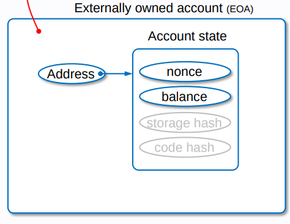
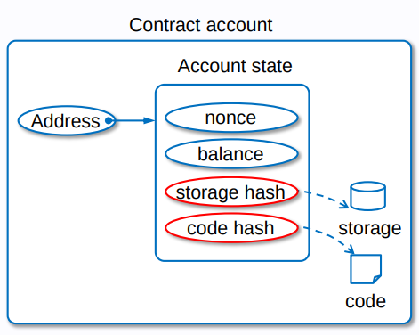

همانطور که میدانید اتریوم از مدل account based  بجای UTXO استفاده میکند.
اکانت ها در اتریوم، با شبکه بیتکوین تفاوت هایی اساسی دارند. اکانت های اتریوم بصورت کلی به دو دسته EOA و CA تقسیم میشوند.
(external owned account) (contract account)

در ادامه به خصوصیات و جزییات هر یک از اکانت های کانترکت و اکانت های مالک خارجی (کنترل شده توسط شخص) میپردازیم.

# 12.3.4.1 external owned accounts (EOA)

حساب های کنترل شده توسط افراد خارجی یا کنترل شده توسط شخص، حساب هایی معمولی هستند که توانایی نگهداری ارز اتر و انتقال ان با استفاده از ایجاد تراکنش بر روی شبکه را دارند.

این اکانت ها با یک کلید خصوصی کنترل میشوند.

این اکانت های دارای دو بخش هستند (هر ادرس یا کلید عمومی به یک فیلد دو بخشی از این اطلاعات در ورلد استیت اتریوم اشاره دارد.)

## 12.3.4.1.1 nonce

 مقدار اول یا عدد نانس یک شمارنده برای حساب مورد نظر است. در ازای هر تراکنش که حساب شما ایجاد میکند یک واحد به مقدار نانس اضافه میشود. برای مثال اگر نانس حساب شما  ۱۳ باشد یعنی شما تا به حال ۱۴ تراکنش ایجاد کرده اید. (شمارش از ۰ شروع میشود) اما گفتنی است که خواندن اطلاعات یا تراکنش هایی که به حساب شما به عنوان مقصد صورت میگیرد تاثیری در نانس حساب شما ندارد.

 اما بحث اصلی خاصیت عدد نانس است. زمانی که حساب شما تراکنشی ایجاد میکند تراکنش مورد نظر شامل عدد نانس حساب مبدا هم میشود. در همین حین نود های اتریوم میتوانند بر اساس نانس تراکنش شما را از روی ترتیب این شمارنده اجرا کنند. (در شبکه اتریوم انتخاب تراکنش توسط نود ها پردازش انها بصورت کلی به ترتیب نیست و بستگی به نود ها و بار شبکه و تراکنش دارد. در بخش تراکنش به جزییات این مساله میپردازیم.) یعنی اگر سه تراکنش متوالی از طرف شما ثبت شود. به انها بر اساس نانس ترتیب بندی میشوند و با اینکه اجرای کل تراکنش ها به ترتیب نیست اما تراکنش های هر شخص باید دقیقا زمانی اجرا شوند که یک واحد به نانس فعلی اضافه کنند. و در این حالت ترتیب تراکنش های شما حفظ خواهد شد.

 اما یکی از کاربرد های اصلی نانس جلوگیری از حمله تکرار است. (reply attack) برای مثال اگر الیس به باب ۱ اتر انتقال دهد. و این تراکنش شامل نانس نشود. باب با پیدا کردن تراکنش امضا شده الیس بر بستر شبکه میتواند انرا تکرار کند و از موجودی حساب الیس کم کند. اما زمانی که در تراکنش امضا شده نانس هم قرار بگیرد هر تراکنش حتی با مقصد و مبدا و مبلغ ثابت هم از هم متمایز هستند. و زمانی که تراکنشی تکراری ثبت شود نانس مورد نظر با نانس حساب مبدا همخوانی ندارد. پس نود ها انرا رد میکنند. و باب نیاز دارد تا یک تراکنش جدید با نانس جدید داشته باشد.

## 12.3.4.1.2 balance

مقدار دوم یک بالانس یا موجودی است که بطور خلاصه این بالانس مقدار موجودی اتر یک حساب را نمایش میدهد و نگهداری میکند.

# 12.3.4.2 contract accounts (CA)

نوع دوم اکانت های اتریوم اکانت های قرار داد هوشمند است. این حساب ها قابلیت پردازش تراکنش و ایجاد تغییر در ورلد استیت را دارا هستند.
در ادامه به جزییات اسن حساب ها میپردازیم.

## 12.3.4.2.1 nonce
## 12.3.4.2.2 balance
## 12.3.4.2.3 storage hash
## 12.3.4.2.4 code hash