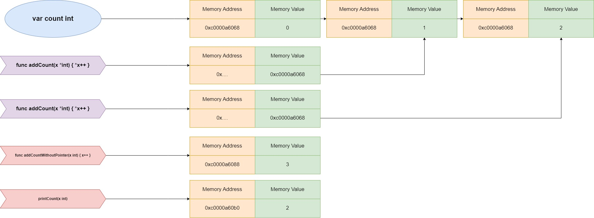

 در واقع متغیری است که، آدرس حافظه یک مقدار را نگه می‌دارد.

```go
var ex *T
```

در مثال بالا ما شیوه تعریف یک متغیر اشاره‌گر را توضیح دادیم. اول کلید واژه ی **var** بعد اسم متغیر و در آخر هم *T یعنی تایپ متغیر. به مثال زیر توجه کنید:


```go
var ptr *string
```

در تعریف ‌ها, ما ۲ تا اپراتور داریم که کارکرد هر کدام از این اپراتورها رو در ادامه توضیح میدم:

- `&` `بهش میگن ampersand` با استفاده از این می‌توانیم آدرس حافظه متغیر فرضا x را به متغیر دیگری بدهیم (`y := &x`)
- `*` `بهش میگن asterisk` با استفاده از این می‌توانیم به مقدار داخل حافظه متغیر فرضا x دسترسی پیدا کنیم (`x*`)

برای اینکه یک  تعریف کنیم ۲ روش وجود دارد:

1. استفاده از تابع `new` 
2. استفاده از اپراتور `&` (آمپرسند)

## 2.1.1 استفاده از تابع new

یک  با استفاده از تابع `new` بصورت مثال زیر تعریف شده است:

```go
a := new(int)
*a = 10
fmt.Println(*a) //Output will be 10
```

در مثال بالا ما متغیر a را از نوع int اشاره‌گر `pointer a` تعریف کردیم و سپس داخل آدرس حافظه a  مقدار ۱۰ را قرار دادیم.


توجه کنید مقدار پیش‌فرض یک متغیر از نوع  `nil` است. اگر جایی شما متغیر از نوع   را بصورت `nil` بفرستید ممکن است به panic از نوع **nil pointer** بر بخورید و اجرای برنامه شما کاملا متوقف شود.


## 2.1.2 استفاده از اپراتور '&' 

برای دریافت آدرس حافظه یک متغیر از `&`  می‌توان استفاده کرد:

```go
a := 2
b := &a
fmt.Println(*b) //Output will be 2
```

به مثال زیر توجه کنید:

```go
package main

import "fmt"

func main() {
    var b *int
    a := 2
    b = &a
    
    fmt.Println(b)
    fmt.Println(*b)
    b = new(int)
    *b = 10
    fmt.Println(*b) 
}
```

```shell
$ go run main.go
0xc0000b0018
2
10
```

در خروجی بالا `0xc0000b0018` آدرس حافظه متغیر a است. در واقع متغیر a ساخته شد و ما آدرس حافظه آن را به متغیر b دادیم. یعنی  هر دو متغیر به یک آدرس از حافظه اشاره می‌کنند.

## 2.1.3 اپراتور * اشاره‌گر

ما می‌توانیم اپراتور * را برای عملیات‌های زیر به کار ببریم:

- گرفتن مقدار یک آدرس حافظه که با استفاده از اشاره‌گر ذخیره شده است.
- تغییر مقدار یک آدرس حافظه. 
### به مثال زیر توجه کنید:

```go
package main

import "fmt"

func main() {
	a := 2
	b := &a
	fmt.Println(a)
	fmt.Println(*b)

	*b = 3
	fmt.Println(a)
	fmt.Println(*b)

	a = 4
	fmt.Println(a)
	fmt.Println(*b)
}
```

```shell
$ go run main.go
2
2
3
3
4
4
```

در مثال بالا `a` و `b*` هر دو دارند به یک آدرس از حافظه اشاره می‌کنند. بنابرین تغییر مقدار یکی از آن‌ها، روی هر دو متغیر تاثیر می‌گذارد.

## 2.1.4 اشاره‌گر به یک اشاره‌گر (Double Pointers)

شما می‌‌توانید یک متغیر اشاره‌گر تعریف کنید و متغیر اشاره‌گر دیگری را بهش اختصاص دهید.

```go
a := 2
b := &a
c := &b
```

 

همانطور که در مثال و عکس بالا می‌بینید، متغیر a مقدارش ۲ و آدرسش در حافظه `0xXXXXXX` است. در مقدار متغیر b ما اشاره کردیم به آدرس حافظه متغیر a و در ادامه در متغیر c به آدرس حافظه متغیر b اشاره کردیم.

زمانیکه شما بخواهید مقدار c را چاپ کنید کافیست از `c**` استفاده کنید تا مقدار ۲ را چاپ کند.

به مثال زیر توجه کنید:

```go
package main

import "fmt"

func main() {
	a := 2
	b := &a
	c := &b

	fmt.Printf("a: %d\n", a)
	fmt.Printf("b: %x\n", b)
	fmt.Printf("c: %x\n", c)

	fmt.Println()
	fmt.Printf("a: %d\n", a)
	fmt.Printf("*&a: %d\n", *&a)
	fmt.Printf("*b: %d\n", *b)
	fmt.Printf("**c: %d\n", **c)

	fmt.Println()
	fmt.Printf("&a: %d\n", &a)
	fmt.Printf("b: %d\n", b)
	fmt.Printf("&*b: %d\n", &*b)
	fmt.Printf("*&b: %d\n", *&b)
	fmt.Printf("*c: %d\n", *c)

	fmt.Println()
	fmt.Printf("&b: %d\n", &b)
	fmt.Printf("c: %d\n", c)
	fmt.Printf("*c: %d\n", *c)
	fmt.Printf("**c: %d\n", **c)
	
}
```

```shell
$ go run main.go
a: 2
b: c000018078
c: c00000e028

a: 2
*&a: 2
*b: 2
**c: 2

&a: 824633819256
b: 824633819256
&*b: 824633819256
*&b: 824633819256
*c: 824633819256

&b: 824633778216
c: 824633778216
*c:824633819256
**c:2
```


توجه کنید در زبان گو علی رغم زبان c استفاده از اشاره‌گر حسابی (Pointer Arithmetic) امکان پذیر نمی‌باشد و در صورت استفاده با خطای زیر مواجه خواهید شد:
```go
package main
func main() {
    a := 1
    b := &a
    b = b + 1
}
```


```shell
$ go run main.go
invalid operation: b + 1 (mismatched types *int and int)
```



