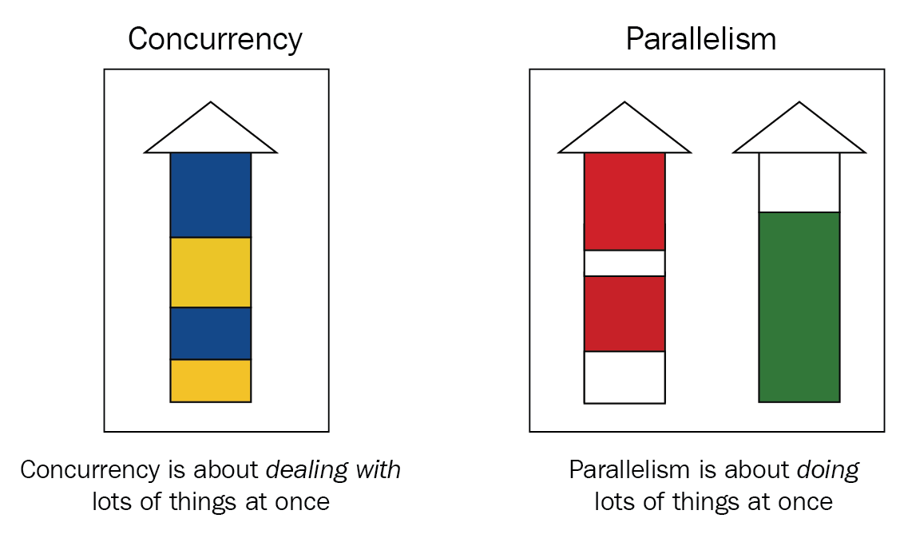

 
 
نرم افزارهای بزرگ اغلب از چندین برنامه کوچک تشکیل شده اند و تمامی این برنامه های کوچک در کنار هم کارهای مختلفی را بطور یکپارچه انجام می دهند. به عنوان مثال یک وب سرور درخواست های مدیریت شده از سمت مرورگرها را مدیریت می کند و در پاسخ صفحات وب HTML را ارائه می دهد و هر در خواست مانند یک برنامه کوچک رسیدگی می شود تا نتیجه را به مرورگر ارائه دهد.

معمولا برنامه های ایده آل برای اینکه بتواند درخواست ها را خیلی سریع پاسخ دهند یا اینکه همزمان به هرکدام از درخواست ها رسیدگی کنند از مقوله ای به نام  استفاده می کنند. حالا فرض کنید شما قصد دارید یک وب سرور بنویسید برای اینکه بتوانید خیلی سریع به درخواست ها پاسخ دهید قاعدتا باید   استفاده کنید.

یکی از نقاط قوت زبان بحث    هستش که در زبان گو خیلی ساده و امن پیاده سازی شده است و  از گوروتین و کانال ها پشتیبانی می کند. که در ادامه این فصل ما به این ۲ تا مقوله می پردازیم و بطور عمیق توضیح می دهیم چطور با    زبان گو کار کنید.

## 3.1.1 فرق بین همزمانی (concurrency) و موازی (parallelism)

موازی سازی (parallelism) یعنی چندین فرآیند بطور همزمان توسط چندین threads یا پردازنده انجام شود و این پردازنده ها می توانند از طریق حافظه مشترک با هم ارتباط برقرار کنند و در نهایت نتایج فرآیندها پس از پایان با هم ترکیب می شوند.

اما برنامه های همزمان می توانند بصورت موازی اجرا شوند یا نه. البته همزمانی بیشتر در مورد ساختار یک برنامه است. همزمانی به گونه ای است که دو یا چند کار مختلف ممکن است به طور همزمان در حال پیشرفت و انجام باشند. و در نهایت این فرآیندهای همزمان به نتایج مختلفی ختم می شوند.

دقت کنید همزمانی نیازی به بیش از یک پردازنده یا threads ندارد ولی برای اینکه بخواهید بصورت موازی کاری را انجام دهید قطعا باید کارها را بین threads ها تقسیم کنید.

 

زبان گو در کنار همزمانی از موازی سازی (parallelism) با استفاده از  GOMAXPROCS پشتیبانی می کند و اجازه می دهد از تمامی هسته های CPU استفاده کنید. هرچند بطور پیش فرض یک برنامه ای که با زبان گو نوشته می شود از تمامی هسته های CPU استفاده می کند و شما می توانید با **GOMAXPROCS** تعداد هسته ها را محدود کنید.

در هر صورت همزمانی و موازی سازی برای بهینه سازی عملکرد برنامه ها استفاده می شود و هر دو این عناوین توسط زبان گو به واسطه گوروتین و کانال پشتیبانی می شود.