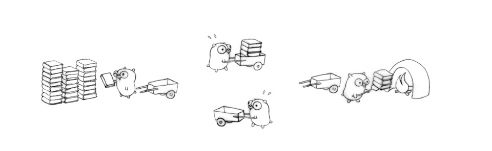
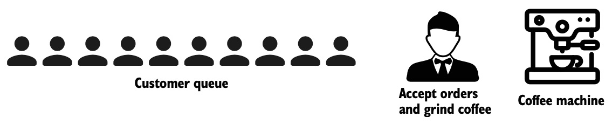
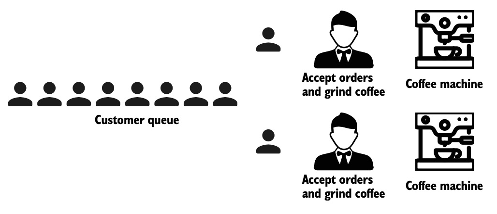
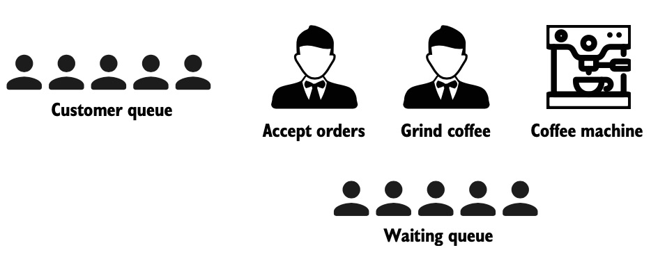
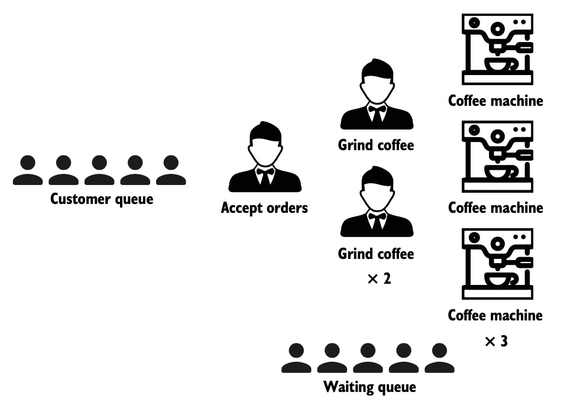

 
 
نرم‌افزارهای بزرگ به منظور توسعه راحت‌تر و  بیشتر و همچنین  از ده‌ها زیر برنامه کوچک‌تر تشکیل می‌شوند که به آنها توابع می‌گوییم و تمامی این زیربرنامه‌های کوچک در کنار هم اما به صورت مستقل عملکرد کلی برنامه بزرگتر را شکل می‌دهند. به عنوان مثال یک وب سرور درخواست‌های ارسال شده از سمت مرورگرها را مدیریت می کند و در پاسخ صفحات وب HTML را آماده کرده و ارائه می‌دهد و هر در خواست از طریق فراخوانی چندین برنامه کوچک رسیدگی می شود تا نتیجه را به مرورگر برگردانده شود.

در طول آماده‌سازی نتیجه‌‌ی هر یک از این زیربرنامه‌ها، به دلایل گوناگون از جمله تاخیر(های) شبکه، IO و ... اجرای زیربرنامه‌ها برای مدتی هرچند کوتاه متوقف می‌شود و این وقفه‌ها، زمان پاسخگویی نرم‌افزارها را طولانی‌تر می‌کنند؛ گاهی‌اوقات اولویت ترتیب اجرا و وابستگی/استقلال زیربرنامه‌ها، به توسعه‌دهنده این اجازه را می‌دهد که اجرای بعضی از زیربرنامه‌ها را از حالت «صف/ترتیبی» به حالت «موازی» تغییر دهد، لذا به منظور استفاده بهینه‌ از منابع و افزایش **عملکرد کلی** نرم‌افزار از مقوله‌ای به نام  استفاده می کنند.

یکی از نقاط قوت در زبان Go سهولت و امنیت استفاده از  با کمک گوروتین و کانال‌هاست که در ادامه‌ی این فصل به‌طور جامع، مباحث مربوط به آن را بررسی کرده و روش پیاده‌سازی  در برنامه‌های زبان Go را آموزش خواهیم داد.

## ۳.۱.۱ فرق بین همزمانی (concurrency) و موازی (parallelism)

موازی‌سازی (parallelism) یعنی چندین فرآیند به‌طور همزمان توسط چند threads یا به طور دقیق‌تر هسته پردازشی انجام شود و این هسته‌ها می‌توانند از طریق حافظه اشتراکی با هم ارتباط برقرار کنند و در نهایت نتایج فرآیندها پس از پایان با هم ترکیب می‌شوند. لذا داشتن حداقل دو یا چند هسته پردازش فیزیکی از الزامات پیاده‌سازی موازی است.

در مقابل برنامه‌های همزمان الزاماً به‌صورت موازی اجرا نمی‌شوند و بیشتر در مورد ساختار یک برنامه است تا شیوه دقیق اجرای آن برنامه یا زیربرنامه. همزمانی به گونه‌ای است که دو یا چند کار مختلف ممکن است به طور همزمان در حال پیشرفت و انجام باشند. و در نهایت این فرآیندهای همزمان به نتایج مختلفی ختم می شوند.

حال می‌خواهیم با یک مثال ملموس این دو مبحث را باز کنیم تا به درکی دقیق‌تر از تفاوت این‌ دو برسیم. 

تصور کنید که برنامه بزرگ ما یک کافی‌شاپ است که صفی از مشتریان سفارش خود را داده و منتظر دریافت آن می‌شوند.

همانطور که از تصویر بالا متوجه می‌شوید مشتری دوم تا پایان آماده‌سازی سفارش مشتری اول باید منتظر بماند لذا به منظور بالا بردن کارایی کلی سیستم می‌توان از پردازش موازی بهره برد به این منظور با استخدام یک فرد دیگر و یک دستگاه قهوه سازی دیگر پردازش مشتریان را به صورت موازی انجام خواهیم داد.

چنانچه پیشتر هم گفته شد ما با محدودیت منابع روبرو هستیم و برای بالا بردن تعداد پردازش‌های موازی نیازمند خرید دستگاه قهوه ساز جدید و استخدام نیروی جدید هستیم.
تا به اینجا هدف این بود که مشکل انتظار طولانی مدت مشتریان در صف را از طریق پردازش موازی حل کنیم اما این کار بسیار پرهزینه است راه حل دیگری هم وجود دارد که همان همزمانی است.
بدیهی است وقفه ایجاد شده برای آماده‌سازی سفارش تنها محدود به دستگاه قهوه‌ساز نیست و بخشی از آن مربوط به زمان سپری شده برای دریافت سفارش از مشتریان توسط باریستا و مراجعه به دستگاه برای آماده‌سازی آن می‌شود لذا می‌توان با استخدام یک نیروی جدید بدون خرید دستگاه قهوه‌ساز جدید سفارش مشتریان را به صورت جداگانه پردازش کرده و به‌جای صف سفارش یک صف انتظار آماده‌سازی تشکیل داد به این ترتیب مدت زمان انتظار افراد برای دریافت سفارش کوتاه تر شده و **عملکر کلی** سیستم افزایش می‌یابد.

البته هیچ چیز ما را محدود به پردازش سریال در حالت همزمانی نمی‌کند یعنی در صورت تشکیل صف طولانی می توانیم عملکرد موازی را اینجا هم اعمال کنیم به تصویر پایین دقت کنید.

همانطور که مشاهده می‌شود در پردازش همزمان ما با تغییر ساختار به صورت موازی یا غیرموازی عملکرد کلی سیستم را افزایش داده‌ایم.

نکته: تا به اینجا بارها برروی عملکرد کلی سیستم تأکید نموده‌ایم. این مسئله از آنجا حائز اهمیت است که خواننده باید به درکی درست از مقوله همزمانی برسد. ما در همزمانی سرعت پردازش یک درخواست را افزایش نمی‌دهیم در حقیقت به دلیل پیچیده‌تر شدن پیاده‌سازی و روند اجرا، زمان پردازش یک درخواست منحصر به فرد طولانی‌تر هم می‌شود اما آنچه در مبحث همزمانی بهبود می‌یابد عملکرد کلی سیستم است. لذا استفاده از همزمانی تنها در صورتی می‌تواند به بهبود کارایی یک سیستم نرم‌افزاری منجر شود که صفی از درخواست‌ها تشکیل شده باشد و تأخیرات مختلف مانع از پردازش بی‌درنگ درخواست‌ها در اکثر مواقع نشود لذا با استفاده از پیاده‌سازی همزمانی از منابع سیستم در زمان انتظار درخواست‌ها به صورت بهینه استفاده خواهد شد.

در زبان Go با استفاده از  GOMAXPROCS در کنار همزمانی از موازی‌سازی (parallelism) هم استفاده می‌شود. هرچند بطور پیش فرض برنامه‌ای که با زبان گو نوشته می‌شود از تمامی هسته‌های CPU استفاده می‌کند ولی شما می‌توانید با **GOMAXPROCS** تعداد هسته‌ها را محدود کنید. لازم به ذکر است که در زبان Go شما به طور مستقیم نمی‌توانید اجرای موازی زیربرنامه‌ای را به کامپایلر دیکته کنید و تصمیم‌گیری در این مورد به عهده Go Runtime Scheduler است.
