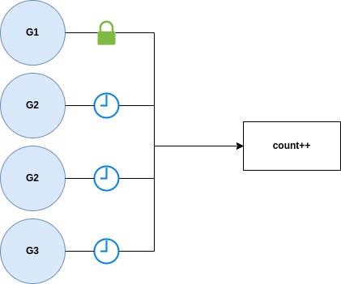

پکیج `sync` یکی از کاربردی ترین پکیج ها در زمینه همزمانی می باشد و یکسری تایپ و توابع برای و کنترل دسترسی همزمان به داده مشترک ارائه می دهد. که پرکاربردترین آن ها :

- `Mutex` : با استفاده از این می توانید آن بخش از داده ای که گوروتین ها بطور همزمان قصد دارند دسترسی داشته باشند را می توانید قفل کنید.
- `RWMutex` : با استفاده از این می توانید به چندین گوروتین اجازه خواندن دهید ولی فقط یک گوروتین می تواند بنویسد در یک زمان.
- `WaitGroup`: یک هماهنگ کننده گوروتین می باشد برای اینکه ترتیب عملیات ها در هنگام همزمانی رعایت شود.
- `Once`:  این اجازه می دهد یک تابع حداکثر یک بار اجرا شود.
- **Pool:** مجموعه از آبجکت های موقت که امکان ذخیره و دریافت دارند بدون اینکه بخشی از حافظه را اشتغال کنند.


توجه کنید که پکیج `sync` فقط و فقط برای مدیریت و همگام سازی دسترسی های گوروتین ها به یک داده مشترک استفاده می شود. 



## 3.3.1 Mutex

در پکیج `sync` یک تایپ به نام `Mutex` وجود دارد که به شما این امکان را می دهد دسترسی به داده مشترک را   کنید. زمانیکه از تایپ Mutex استفاده می کند ۲ حالت دارد Lock یا Unlock. وقتی شما Lock می کند فقط و فقط یک گوروتین می تواند برروی آن بخش از داده کار کند و تا زمانیکه شما Unlock نکنید سایر گوروتین ها نمی توانند دسترسی داشته باشند و تا زمانیکه Unlock صورت گیرد سایر گوروتین ها تلاش می کنند تا بتوانند دسترسی پیدا کنند.

به مثال زیر توجه کنید :

```go
package main

import (
	"fmt"
	"sync"
	"time"
)

var count int

func main() {
	mu := new(sync.Mutex)
	
	go increment(mu)
	go increment(mu)
	go increment(mu)
	go increment(mu)

	time.Sleep(time.Second)
}

func increment(mu *sync.Mutex) {
	mu.Lock()
	defer mu.Unlock()
	count++
	fmt.Printf("Incrementing: %d\n", count)
}
```

```shell
$ go run main.go

Incrementing: 1
Incrementing: 2
Incrementing: 3
Incrementing: 4
```

 


در بالا ما یک تابع به نام increment ایجاد کردیم و به عنوان ورودی تایپ Mutex را بصورت پوینتر پاس  دادیم. سپس با استفاده از توابع Lock و Unlock برای افزایش مقدار count یک قفل گذاشتیم.

حال ۴ تا گوروتین داریم که قصد دارند همزمان روی بخش مشترک از حافظه عملیاتی را انجام دهند در اینجا ما با استفاده Mutex جلوی اینکه همزمان دسترسی داشته باشند به اون داده از حافظه را گرفتیم و فقط یک گوروتین می تواند عملیات انجام دهد و تا زمانیکه شما Unlock نکنید سایر گوروتین ها منتظر می مانند.

### 3.3.1.1 سناریوهای استفاده

1. **همگام سازی دسترسی به متغیرهای مشترک:** یک mutex می تواند برای همگام سازی دسترسی به متغیرهای مشترک بین چندین گوروتین استفاده شود. این می تواند در مواردی مفید باشد که چندین گوروتین نیاز به خواندن یا به روز رسانی یک متغیر به طور همزمان دارند.

2. **هماهنگی دسترسی به حالت مشترک:** یک mutex می تواند برای هماهنگ کردن دسترسی به حالت مشترک بین چندین گوروتین استفاده شود. به عنوان مثال، ممکن است از یک mutex استفاده کنید تا اطمینان حاصل کنید که فقط یک گوروتین می تواند یک ساختار داده مشترک را در یک زمان تغییر دهد.

3. **پیاده سازی الگوهای تولیدکننده-مصرف کننده (producer-consumer):** یک mutex می تواند برای پیاده سازی الگوهای تولیدکننده-مصرف کننده استفاده شود، که در آن یک یا چند گوروتین داده تولید می کنند و یک یا چند گوروتین آن را مصرف می کنند. mutex می تواند برای همگام سازی دسترسی به ساختار داده مشترک که داده ها را نگه می دارد استفاده شود.


**۲ نکته خیلی مهم**

1. سعی کنید پس از اینکه تابع Lock را فراخوانی میکنید تابع Unlock را داخل defer قرار دهید.
2. زمانیکه قصد دارید Mutex را به عنوان پارامتر ورودی برای توابع تعریف کنید بهتر است از نوع  باشد.


## 3.3.2 RWMutex

در پکیج `sync` یک تایپ به نام `RWMutex` وجود دارد که عملیات خواندن و نوشتن برروی یک داده مشترک را  می کند. شما می توانید به چندین گوروتین اجازه خواندن یک داده مشترک را بدهید ولی فقط یک گوروتین می تواند عملیات نوشتن را برروی آن داده مشترک را انجام دهد.


## 3.3.3 WaitGroup


## 3.3.4 Once


## 3.3.5 Pool

در نسخه ۱.۳ زبان گو امکانی تایپی به نام Pool در پکیج sync که امکان ایجاد استخر آبجکت ها بطور موقت بدون اینکه بخواهد بخشی از حافظه را اشتغال کند اضافه شد.

هر آبجکتی که در Pool ذخیره شود بطور خودکار در هرزمانی بدون اینکه اطلاع رسانی کند حذف می شود. 

```go
package main

import (
	"bytes"
	"io"
	"os"
	"sync"
	"time"
)

var bufPool = sync.Pool{
	New: func() any {
		// The Pool's New function should generally only return pointer
		// types, since a pointer can be put into the return interface
		// value without an allocation:
		return new(bytes.Buffer)
	},
}

// timeNow is a fake version of time.Now for tests.
func timeNow() time.Time {
	return time.Unix(1136214245, 0)
}

func Log(w io.Writer, key, val string) {
	b := bufPool.Get().(*bytes.Buffer)
	b.Reset()
	// Replace this with time.Now() in a real logger.
	b.WriteString(timeNow().UTC().Format(time.RFC3339))
	b.WriteByte(' ')
	b.WriteString(key)
	b.WriteByte('=')
	b.WriteString(val)
	w.Write(b.Bytes())
	bufPool.Put(b)
}

func main() {
	Log(os.Stdout, "path", "/search?q=flowers")
}
```

```shell
$ go run main.go
2006-01-02T15:04:05Z path=/search?q=flowers
```

در بالا ما یک متغیر به نام bufPool ایجاد کردیم که یک آبجکت از نوع bytes.Buffer ایجاد می کند. سپس داخل تابع Log ما با استفاده از متد Get آبجکت مورد نظر را از Pool خارج و داخل متغیر b قرار دادیم و پس از آن عملیات لازم را برروی Buffer انجام و در نهایت با استفاده از متد Put آبجکت را به Pool اضافه کردیم. حالا اتفاقی که صورت گرفته ما عملیاتی که نیاز داشتیم را برروی آبجکت انجام دادیم بدون اینکه بخوایم بخشی از حافظه را درگیر کنیم.


**یک نمونه بنچمارک در خصوص Pool**

```go
type Person struct {
	Age int
}

var personPool = sync.Pool{
	New: func() interface{} { return new(Person) },
}

func BenchmarkWithoutPool(b *testing.B) {
	var p *Person
	b.ReportAllocs()
	b.ResetTimer()
	for i := 0; i < b.N; i++ {
		for j := 0; j < 10000; j++ {
			p = new(Person)
			p.Age = 23
		}
	}
}

func BenchmarkWithPool(b *testing.B) {
	var p *Person
	b.ReportAllocs()
	b.ResetTimer()
	for i := 0; i < b.N; i++ {
		for j := 0; j < 10000; j++ {
			p = personPool.Get().(*Person)
			p.Age = 23
			personPool.Put(p)
		}
	}
}
```


```shell
BenchmarkWithoutPool  
BenchmarkWithoutPool-8 160698 ns/op 80001 B/op 10000 allocs/op  

BenchmarkWithPool  
BenchmarkWithPool-8 191163 ns/op 0 B/op 0 allocs/op
```
