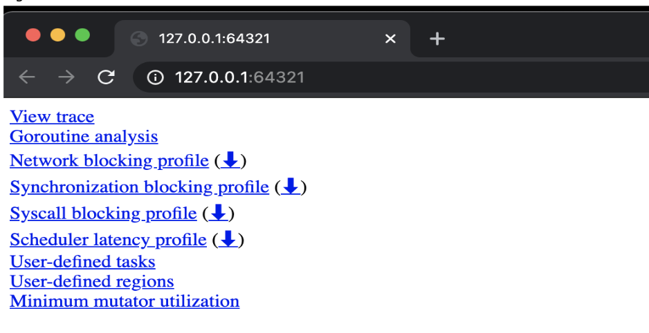
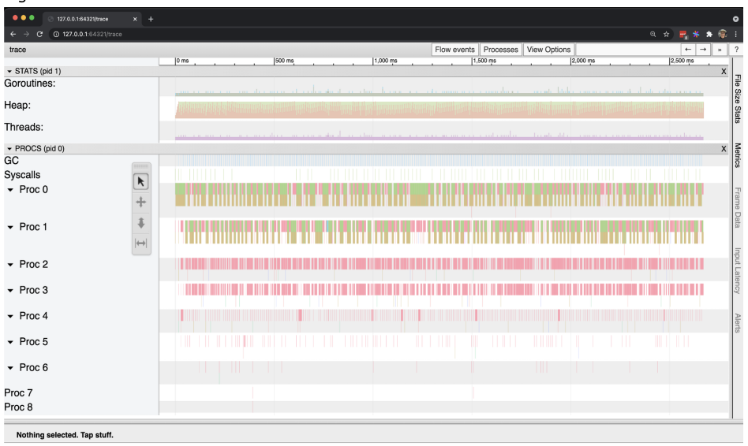
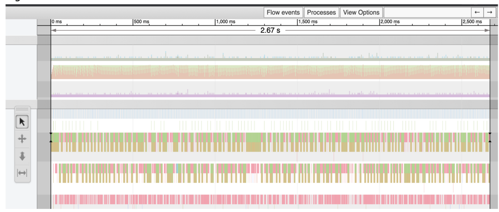
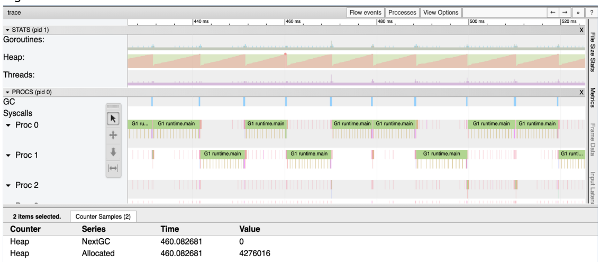
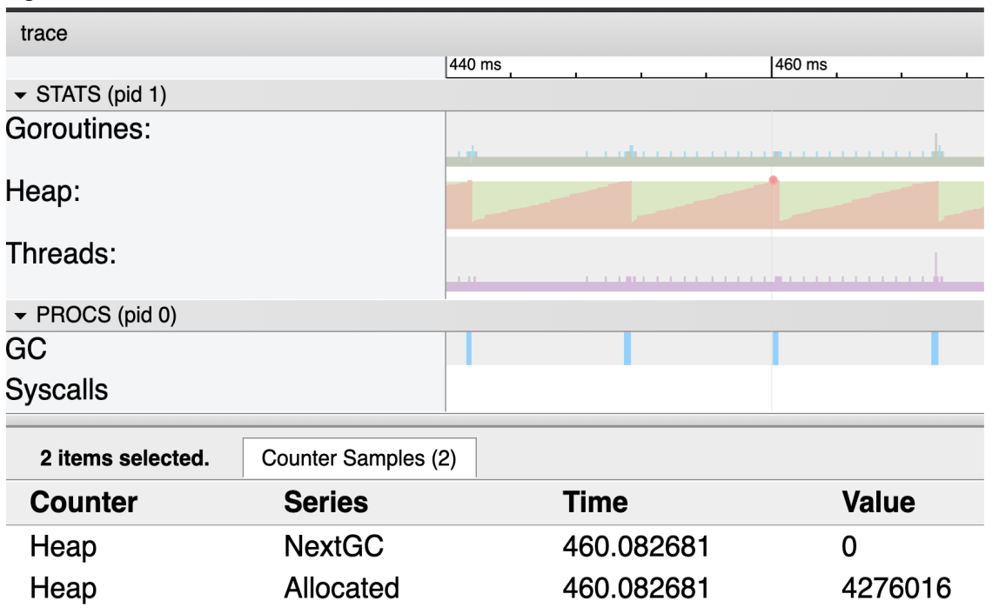
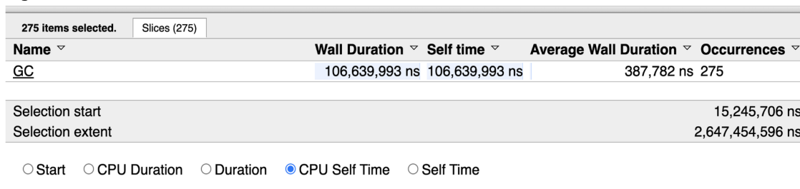
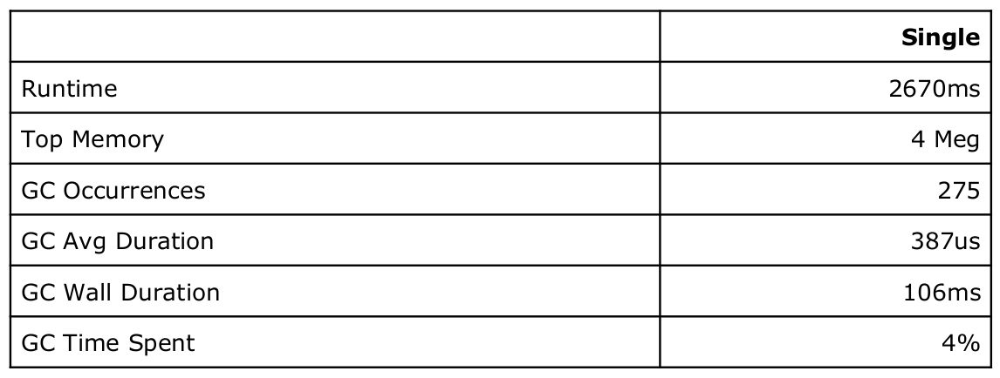
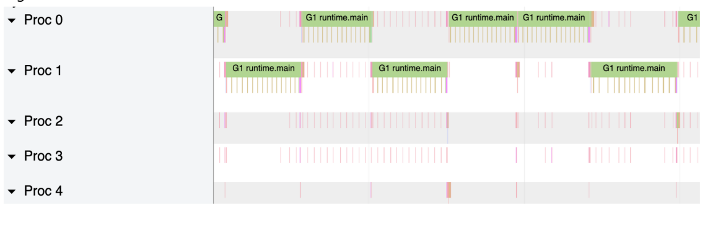

در این فصل، این مورد را یاد خواهیم گرفت که چگونه   یک برنامه در حال اجرا را ردیابی کنیم و آن را با ابزار ردیابی مشاهده کنیم. در این حالت با استفاده از کتابخانه استاندارد، یک ردیابی ایجاد خواهیم کرد. 

## 4.24.1  مثال از tracing


ما برنامه ای داریم که تعداد دفعات یافتن یک topic را در collection ای ازRSS news feed document را می شمارد. این برنامه از یک threaded algorithm به نام freq استفاده می کند که روی collection تکرار می شود و هر سند را یک به یک پردازش می کند و تعداد دفعاتی که topic پیدا شده است را برمی‌گرداند.

```go
func freq(topic string, docs []string) int {
	var found int
	for _, doc := range docs {
		file := fmt.Sprintf("%s.xml", doc[:8])
		f, err := os.OpenFile(file, os.O_RDONLY, 0)
		if err != nil {
			log.Printf("Opening Document [%s] : ERROR : %v", doc, err)
			return 0
		}
		data, err := io.ReadAll(f)
		f.Close()
		if err != nil {
			log.Printf("Reading Document [%s] : ERROR : %v", doc, err)
			return 0
		}
		var d document
		if err := xml.Unmarshal(data, &d); err != nil {
			log.Printf("Decoding Document [%s] : ERROR : %v", doc, err)
			return 0
		}
		for _, item := range d.Channel.Items {
			if strings.Contains(item.Title, topic) {
				found++
				continue
			}
			if strings.Contains(item.Description, topic) {
				found++
			}
		}
	}
	return found
}
```

تابع Freq کار را به چهار مرحله تقسیم می کند: باز کردن، خواندن، باز کردن و جستجو. برای تست تابع freq، تابع main مجموعه ای از فایل های 4k را می سازد و freq را فراخوانی می کند.

```go
type (

item struct {

XMLName xml.Name `xml:"item"`

Title string `xml:"title"`

Description string `xml:"description"`

}

  

channel struct {

XMLName xml.Name `xml:"channel"`

Items []item `xml:"item"`

}

  

document struct {

XMLName xml.Name `xml:"rss"`

Channel channel `xml:"channel"`

}

)

  

func main() {

docs := make([]string, 4000)

for i := range docs {

docs[i] = fmt.Sprintf("newsfeed-%.4d.xml", i)

}

topic := "president"

n := freq(topic, docs)

log.Printf("Searching %d files, found %s %d times.", len(docs), topic, n)

}
```

کدی که تکه‌ای از اسناد 4k را می‌سازد، مجموعه‌ای از فایل‌های منحصربه‌فرد را براساس یک فایل واقعی که ما newfeed.xml نامیده‌ایم ایجاد می‌کند.

```xml
newsfeed.xml

<?xml version="1.0" encoding="UTF-8"?>

<?xml-stylesheet title="XSL_formatting" type="text/xsl"?>

<rss>

<channel>

<title><![CDATA[BBC News - US & Canada]]></title>

<description><![CDATA[BBC News - US & Canada]]></description>

<item>

<title><![CDATA[President China visit: US leader strik]]></title>

<description><![CDATA[The US president praises]]></description>

</item>

</channel>

</rss>
```

این یک نمونه بسیار کوچک از فایل newsfeed.xml است. به جای اینکه فایل های واقعی 4k را نگه داریم، فقط یک فایل را نگه می داریم و تلاش می کنیم که 4k یکی از آنها را نشان دهد. الگوریتم freq کاراکترهای اضافی را از نام فایل، قبل از باز کردن فایل حذف می کند. خوب است که یک ایده اولیه از مدت زمان لازم برای پردازش این 4000 فایل با نسخه تک رشته ای Freq داشته باشید. پس می توانیم این کار را با استفاده از time command در ارتباط با اجرای برنامه انجام دهیم.

```shell
$ go build
$ time ./trace
2021/05/12 09:30:52 Searching 4000 files, found president 28000 times.
./trace 2.63s user 0.18s system 101% cpu 2.763 total
```


 می بینیم که زمان اجرای برنامه حدود 2.7 ثانیه طول کشید تا فایل های 4k را پردازش کند. اگر قرار بود فقط فایل‌های 4k یا شاید حتی چند هزار فایل دیگر را پردازش کنیم،  این برنامه تکمیل شده و تمام بود. با این حال، در نظر داریم که توانایی پردازش یک میلیون فایل را داشته باشیم و تجزیه و تحلیل آن ساعت‌ها طول نکشد. پس باید راهی برای افزایش سرعت این برنامه پیدا کنیم. در واقع می‌توانیم از یک memory profile استفاده کنیم، هر چند که این برنامه از memory گذرا زیادی استفاده می‌کند و کار زیادی نمی‌توانیم در مورد آن انجام دهیم. پس می‌توانیم از یک   cpu profile استفاده کنیم. این روش به در واقع بیان می‌کند که به لطف فراخوانی با os.OpenFile، بیشتر زمان را در فراخوانی و رخدادهای سیستمی مصرف می‌کنیم. مشکل استفاده از profiler در اینجا این است که یک profiler فقط می تواند   بگوید که چه اتفاقی می افتد ولی  باید بدانیم چه چیزی اتفاقی می افتد و چه چیزی اتفاق نمی افتد تا راهی برای سرعت بخشیدن به این برنامه پیدا کنیم. وقتی باید ببینیم چه اتفاقی نیافتاده، ابزار ردیابی گزینه خوبی است.

## 4.24.2  Generating Traces

از آنجایی که این برنامه در عرض چند ثانیه شروع و متوقف می شود، می توانیم از کتابخانه استاندارد برای ایجاد ردی از این برنامه استفاده کنم. به طور کلی، ایجاد ردیابی برای بیش از چند ثانیه از زمان اجرا می‌تواند برای بررسی سخت باشد، زیرا یک ردیابی مقدار زیادی داده تولید می‌کند. ما می خواهیم بر روی ردپاهای کوچک و هدفمند تمرکز کنیم.

```go
import (

"runtime/trace" //<-- ADDED

)

  

func main() {

trace.Start(os.Stdout) // <-- ADDED

defer trace.Stop() // <-- ADDED

  

docs := make([]string, 4000)

for i := range docs {

docs[i] = fmt.Sprintf("newsfeed-%.4d.xml", i)

}

  

topic := "president"

n := freq(topic, docs)

log.Printf("Search %d files, found %s %d times.", len(docs), topic, n)

}
```

پس از افزودن بسته trace به importها، می توانیم از توابع trace.Start و Stop استفاده کنیم. نوشتن ردیابی در stdout گرفتن و تغییر مسیر داده های ردیابی به یک فایل را ساده می کند. حالا می توانم دوباره برنامه را اجرا کنیم.

```shell
$ go build

  

$ time ./trace > t.out

2021/05/12 11:57:06 Search 4000 files, found president 28000 times.

./trace > t.out 2.71s user 0.19s system 102% cpu 2.827 total

  

$ time ./trace > t.out

2021/05/12 11:57:11 Search 4000 files, found president 28000 times.

./trace > t.out 2.73s user 0.18s system 108% cpu 2.683 total

  

$ ls -l

total 9136

-rw-r--r-- 1 bill staff 2108 Jan 4 08:16 README.md

-rw-r--r-- 1 bill staff 25544 Jan 4 08:16 newsfeed.xml

-rw-r--r-- 1 bill staff 1501618 May 12 11:57 t.out

-rwxr-xr-x 1 bill staff 2470208 May 12 11:57 trace

-rw-r--r-- 1 bill staff 8135 May 12 11:56 trace.go
```


ما همیشه برنامه را دو بار اجرا می کنیم تا مطمئن شوم دستگاه گرم شده است. اجرای دوم معمولا بهتر از اولین اجرا می شود و من می توانم 144 میلی ثانیه تفاوت بین این دو اجرا ببینم. همچنین می‌توانم ببینم که فایل t.out در فهرست، 1.5 مگ داده در طول 2.6 ثانیه زمان اجرا گرفته است.


## 4.24.3  Generating Traces

برای بررسی ردیابی، باید از ابزار ردیابی استفاده کنم.

```shell
$ go tool trace t.out

  

2021/05/12 12:00:19 Parsing trace...

2021/05/12 12:00:19 Splitting trace...

2021/05/12 12:00:19 Opening browser. Trace viewer is listening on

http://127.0.0.1:64321
```

پس از تجزیه و تقسیم فایل، یک برگه مرورگر با مجموعه ای از  linkها باز می شود.

  

حالا می‌خواهیم اولین link را انتخاب کنیم که یک رابط کاربری مبتنی بر Chrome را باز می‌کند که می‌تواند داده‌های ردیابی را ارائه دهد. این ابزار فقط در کروم کار می کند.

  

تمام اطلاعاتی که ارائه می شود تا میکروثانیه زمان وقوع آن ثبت می شود. در سمت چپ، می توانیم دسته های مختلف اطلاعات نموداری را ببینم.

در هر زمان معین در ردیابی موارد زیر را داریم:

● Goroutines: The number of Goroutines.

● Heap: The amount of memory in-use on the heap.

● Threads: The number of operating system threads.

● GC: The start/end of each GC with details.

● Syscalls: The start/end of any system call with details.

● Procs: The activity on each logical processor.


اولین کاری که باید انجام دهیم اندازه گیری مدت زمان اجرای برنامه بر اساس داده های ردیابی است.  می‌توانیم این کار را با ابزار زمان بندی، که آخرین ابزار در toolbar  است، انجام دهیم.

  

اگرtimeline کل ردیابی را انتخاب کنیم، برابر 2.67 ثانیه خواهد بود که تقریباً به آنچه  time command  ارائه شده است نزدیک است. نکته بعدی که می‌خواهم بدانم این است که اندازه heap چقدر ثابت مانده است یا چقدر بزرگ‌تر شده است. برای این کار باید نمای نمودار را گسترش می دهیم و سپس از ابزار انتخاب (اولین ابزار در نوار ابزار) برای انتخاب قسمت بالای نمودار heap استفاده می کنبم.

  

دو رنگ (یا سایه) وجود دارد که در نمودار heap نشان داده شده است. نارنجی (سایه تیره تر) میزان حافظه در حال استفاده روی heap را در هر میکروثانیه نشان می دهد. سبز (سایه روشن‌تر) نشان‌دهنده زمانی است که GC بعدی بر اساس زمانی که آن مقدار حافظه دوباره در heap مورد استفاده قرار می‌گیرد، راه‌اندازی می‌شود.

  

به همین دلیل است که وقتی ناحیه نارنجی به بالای منطقه سبز می رسد، یک خط در قسمت GC وجود دارد. هر خط نشان دهنده یک GC است که اتفاق افتاده است.

از آنجایی که ناحیه سبز در یک خط مستقیم ثابت برای کل اجرای برنامه است، می توانم هر نقطه نارنجی را برای دیدن حداکثر اندازه heap انتخاب کنیم. در این صورت اگر بخواهم در مورد این عدد وضوح بیشتری داشته باشم، می توانیم از GODEBUG استفاده کنیم و دوباره برنامه را اجرا کنیم.

```go
$ time GODEBUG=gctrace=1 ./trace > t.out

gc 1 @0.016s 0%: 0.020+0.29+0.024 ms clock, 0.32+0.18/0.12/0.12+0.39 ms cpu,

4->4->0 MB, 5 MB goal, 16 P

gc 2 @0.029s 0%: 0.030+0.23+0.002 ms clock, 0.49+0.15/0.17/0.001+0.037 ms

cpu, 4->4->0 MB, 5 MB goal, 16 P

gc 3 @0.040s 0%: 0.033+0.26+0.019 ms clock, 0.52+0.15/0.15/0.059+0.31 ms

cpu, 4->4->0 MB, 5 MB goal, 16 P

. . .

gc 273 @2.793s 0%: 0.043+0.46+0.040 ms clock, 0.70+0.24/0.18/0.25+0.65 ms

cpu, 4->4->0 MB, 5 MB goal, 16 P

gc 274 @2.804s 0%: 0.043+0.35+0.002 ms clock, 0.69+0.28/0.37/0.16+0.042 ms

cpu, 4->4->0 MB, 5 MB goal, 16 P

gc 275 @2.814s 0%: 0.032+0.28+0.017 ms clock, 0.52+0.20/0.26/0.026+0.28 ms

cpu, 4->4->0 MB, 5 MB goal, 16 P

2021/05/12 15:17:24 Searching 4000 files, found president 28000 times.
```

اینطور به نظر می‌رسد که ، heap در meg 4   نگهداری می شد و تمام memory گذرا بوده است زیرا هر GC منجر به صفر بودن تعداد مقادیر زنده می شد. دقیقاً همان چیزی است که  در ردیابی می بینیم. چیزی که واقعاً به آن نیاز داریم اطلاعات بیشتری در مورد GC است. این در مورد 1 GC نیست، بلکه در مورد همه GCهایی است که باید انجام شوند. پس می توانیم این اطلاعات را با استفاده از ابزار انتخاب و دوبار کلیک کردن روی هر خط آبی GC بدست بیاورم.

  


این اعداد در تعیین میزان کار GC در اجرای برنامه مفید هستند. با این اعداد ما یک پایه برای عملکرد برنامه داریم.
  
با اعداد پایه،  هنوز پاسخی در مورد اینکه چگونه می توانم برنامه را سرعت بخشم، نداریم. شاید نگاه کردن به بخش بزرگتری از نمودار کمک کند؟

![[Pasted image 20230619032144.png]]

  

اگر به این بخش از ردیابی دقیق تر نگاه کنیم، می توانیم مشکل را ببینیم. این برنامه فقط از یک پردازنده منطقی در هر زمان معین برای اجرای کار برنامه استفاده می کند. با این حال GC بیشتر منابع استفاده می کند. اگر الگوریتم را به صورت همزمان و friendly برای استفاده از تمام هسته‌های موجود در دستگاه خود تغییر دهیم، شاید این باید به بهبود performance کمک کند. 


## 4.24.4 الگوی Fan-Out

یکی از الگوهای concurrency که می‌توانم استفاده کنیم، الگوی fan-out است. این الگو به ما اجازه می دهد تا یک الگوریتم همزمان با کمترین مقدار تغییر کد داشته باشم. ایده این الگو این است که برای هر فایلی که نیاز به پردازش دارد، یک گوروتین ایجاد می‌کند و به scheduler اجازه می‌دهد تمام Goroutine را مدیریت کند و آنها را در تمام پردازنده‌های منطقی زمان‌بندی کند. ما می توانیم همه این گوروتین ها را fan-out کنیم زیرا ترتیب کار مهم نیست. مهم این است که همه چیز درست انجام شود.

```go
func freqConcurrent(topic string, docs []string) int {

  

var found int

g := len(docs) // <-- ADDED

var wg sync.WaitGroup // <-- ADDED

wg.Add(g) // <-- ADDED

  

for _, doc := range docs {

. . .

}

  

wg.Wait() //<-- ADDED

return int

}
```


برای شروع، باید کدی اضافه کنیم که مطمئن شویم تا زمانی که کار کامل نشده است، تابع freq برنگردد. این به بهترین وجه با استفاده از WaitGroup پیاده سازی می شود. ما با شناسایی تعداد گوروتین هایی که باید ایجاد شوند شروع می کنیم، که با طول docs collection نشان داده می شود. سپس آن عدد را به WaitGroup اضافه می کنم و در پایان تابع منتظر می مانم تا WaitGroup دوباره به صفر برسد.

```go
func freqConcurrent(topic string, docs []string) int {

  

var found int

  

g := len(docs)

var wg sync.WaitGroup

wg.Add(g)

for _, doc := range docs {

go func(doc string) { // <-- ADDED

defer wg.Done() // <-- ADDED

. . .

}(doc) // <-- ADDED

}

  
  

wg.Wait()

return int

}
```


برای شروع، باید کدی اضافه کنیم که مطمئن شود تا زمانی که کار کامل نشده است، تابع freq برنگردد. این به بهترین وجه با استفاده از WaitGroup پیاده سازی می شود. من با شناسایی تعداد گوروتین هایی که باید ایجاد شوند شروع می کنیم، که با طول مجموعه اسناد نشان داده می شود. سپس آن عدد را به WaitGroup اضافه می کنیم و در پایان تابع منتظر می مانم تا WaitGroup دوباره به صفر برسد.

در مرحله بعد، کد موجود را در داخل حلقه for range حول یک Goroutine می پیچیم، جایی که هر document تکرار شده به Goroutine جدید منتقل می شود تا از هرگونه اشکال بسته شدن جلوگیری شود. با وجود Goroutine، می‌توانیم کد WaitGroup را با اطمینان از اینکه هر Goroutine ()wg.Done را قبل از پایان آن فراخوانی می‌کند، نهایی کنیم. آخرین کاری که باید انجام دهیم این است که هنگام پردازش یک فایل، مقدار بازگشتی 0 را از تمام شرایط خطای داخل حلقه حذف کنیم. ممکن است فکر کنیم این کد آماده است زیرا تمام هماهنگی ها با WaitGroup در جای خود است، اما اگر این کد را با race detector اجرا کنیم چه اتفاقی می افتد؟

```shell

$ go build -race

$ ./trace > t.out

==================

WARNING: DATA RACE

Read at 0x00c000157548 by goroutine 21:

main.freq.func1()

/Users/bill/code/go/src/github.com/ardanlabs/gotraining/topics/go/

profiling/trace/trace.go:103 +0x644

Previous write at 0x00c000157548 by goroutine 66:

main.freq.func1()

/Users/bill/code/go/src/github.com/ardanlabs/gotraining/topics/go/

profiling/trace/trace.go:103 +0x65d

. . .

==================
```


   دو خط اول در خروجی می گوید که یک خواندن و یک نوشتن قبلی در همان محل حافظه در همان خط کد در داخل تابع تحت اللفظی وجود دارد. با این وجود در خط 103 چه کدی وجود دارد؟
   ```go
   96 for _, item := range d.Channel.Items {

97 if strings.Contains(item.Title, topic) {

98 found++

99 continue

100 }

101

102 if strings.Contains(item.Description, topic) {

103 found++

104 }

105 }
```

اگر شماره خطوط را به کد اضافه کنیم، می توانیم ببیینم که مورد مربوط به افزایش متغیر پیدا شده است. این کد در واقع دوباره در خط 98 استفاده می شود، بنابراین هر دو خط کد (98، 103) حاوی یک data race است. برای رفع این data race، باید افزایش متغیر پیدا شده را برای استفاده از یک atomic instruction. تغییر دهیم. برای این کار می توانم از atomic package استفاده کنم.

```go
96 for _, item := range d.Channel.Items {

97 if strings.Contains(item.Title, topic) {

98 atomic.AddInt32(&found, 1) // <-- CHANGED

99 continue

100 }

101

102 if strings.Contains(item.Description, topic) {

103 atomic.AddInt32(&found, 1) // <-- CHANGED

104 }

105 }
```


ما خطوط 98 و 103 را برای استفاده از تابع atomic.AddInt32 جایگزین کردم. مشکل این است که این تابع به int32 نیاز دارد نه int، بنابراین باید دو تغییر دیگر انجام دهم.

```go
func freq(topic string, docs []string) int {

var found int32 // <-- CHANGED

. . .

wg.Wait()

return int(found) // <-- CHANGED

}
```

این تغییرات برای استفاده از تابع atomic.AddInt32 و بازگرداندن یک عدد صحیح ضروری است. با این تغییرات، data race از بین خواهد رفت. با این حال، هنوز مشکل دیگری در مورد کد وجود دارد. اینکه آنقدرها هم که می‌توانست با حافظه پنهان سازگار نباشد.

## 4.24.5 Cache Friendly

در حال تکمیل ...