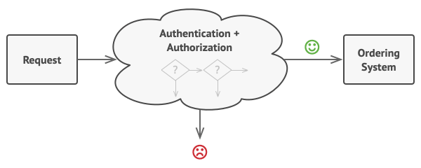

## 9.3.1.1 - الگوی زنجیره مسئولیت (Chain of Responsibility)

الگوی زنجیره مسئولیت (Chain of Responsibility) یک الگوی طراحی رفتاری است که به شما امکان می‌دهد درخواست‌ها را در امتداد زنجیره‌ای از هندلرها (handlers) پاس دهید. هر هندلر پس از دریافت یک درخواست، تصمیم می‌گیرد که درخواست را پردازش کند یا آن را به هندلر بعدی در زنجیره منتقل نماید.

###  9.3.1.2 -  مشکل

فرض کنید روی یک سیستم سفارش آنلاین کار می‌کنید. می‌خواهید دسترسی به سیستم را محدود کنید تا فقط کاربران احراز هویت شده بتوانند سفارش ایجاد کنند. همچنین، کاربرانی که دارای مجوز مدیریت هستند باید دسترسی کامل به تمام سفارشات داشته باشند.

بعد از کمی برنامه‌ریزی، متوجه می‌شوید که این بررسی‌ها باید به صورت متوالی انجام شوند. برنامه می‌تواند هر زمان درخواستی را که حاوی اعتبارنامه (credentials) کاربر است دریافت می‌کند، تلاش کند کاربر را در سیستم احراز هویت کند. با این حال، اگر این اعتبارنامه‌ها صحیح نباشند و احراز هویت با شکست مواجه شود، دلیلی برای ادامه سایر بررسی‌ها وجود ندارد.


در ماه‌های بعد، چندین مورد دیگر از این بررسی‌های متوالی را پیاده‌سازی کردید.

- یکی از همکاران شما پیشنهاد کرده است که انتقال مستقیم داده‌های خام به سیستم سفارش‌دهی ناامن است. بنابراین، یک مرحله اعتبارسنجی اضافی برای تجزیه وتحلیل کردن داده‌ها در یک درخواست اضافه کردید.

- بعداً، کسی متوجه شد که سیستم در برابر کرک رمز عبور با brute force آسیب‌پذیر است. برای جلوگیری از این، به سرعت یک بررسی برای فیلتر کردن درخواست‌های ناموفق مکرر از یک آدرس IP مشابه اضافه کردید.

- فرد دیگری پیشنهاد کرد که با بازگرداندن نتایج کَش (cache) شده در درخواست‌های تکراری حاوی داده‌های یکسان، می‌توانید سرعت سیستم را افزایش دهید. از این رو، یک بررسی دیگر اضافه کردید که به درخواست اجازه می‌دهد تنها در صورتی که پاسخ کَش شده مناسبی وجود نداشته باشد، به سیستم منتقل شود.


کد مورد بررسی که از قبل هم آشفته‌تر به نظر می‌رسد، با اضافه شدن هر قابلیت جدید، بیشتر و بیشتر آشفته می‌شود. تغییر یک قسمت گاهی اوقات بر سایر قسمت‌ها تأثیر می‌گذاشت. بدترین حالت این بود که وقتی می‌خواستید از این بررسی‌ها برای محافظت از دیگر اجزای سیستم استفاده‌ی مجدد کنید، مجبور بودید بخشی از کد را تکرار کنید، زیرا آن اجزا به برخی از بررسی‌ها نیاز داشتند، اما نه به همه‌ی آن‌ها. درک و نگهداری این سیستم بسیار دشوار و پرهزینه است. پس مدت زمانی با کد درگیر بودید تا اینکه یک روز تصمیم گرفتید کل سیستم را بازنگری (refactor) کنید.
### 9.3.1.3 - راه حل 


الگوی زنجیره مسئولیت، مانند بسیاری دیگر از الگوهای طراحی رفتاری، بر تبدیل رفتارهای خاص به اشیاء مستقل به نام هندلر (handler) تکیه دارد. در  این مورد، هر بررسی باید به کلاس خود با یک روش واحد که بررسی را انجام می دهد استخراج شود. درخواست، همراه با داده‌های آن، به عنوان آرگومان به این متد منتقل می‌شود.

این الگو پیشنهاد می‌کند که این هندلرها را به یک زنجیره متصل کنید. هر هندلر متصل دارای فیلدی برای ذخیره مرجع به هندلر بعدی در زنجیره است. هندلرها علاوه بر پردازش یک درخواست، آن را در امتداد زنجیره به جلو منتقل می کنند. درخواست در امتداد زنجیره حرکت می کند تا زمانی که همه هندلرها فرصت پردازش آن را پیدا کنند.

بهترین بخش اینجاست: یک هندلر می تواند تصمیم بگیرد که درخواست را بیشتر به پایین زنجیره منتقل نکند و عملاً پردازش بیشتر را متوقف کند.

در مثال ما با سیستم‌های سفارش، یک هندلر پردازش را انجام می‌دهد و سپس تصمیم می‌گیرد که آیا درخواست را در امتداد زنجیره به پایین منتقل کند یا خیر. با فرض اینکه درخواست حاوی داده‌های صحیح باشد، همه هندلرها می‌توانند رفتار اصلی خود را اجرا کنند، چه این بررسی مربوط به احراز هویت باشد یا ذخیره‌سازی در کَش.


با این حال، رویکرد کمی متفاوت دیگری وجود دارد که در آن، یک هندلر پس از دریافت یک درخواست، تصمیم می‌گیرد که آیا می‌تواند آن را پردازش کند. اگر بتواند پردازش را انجام دهد، دیگر آن را به هیچ وجه به جای دیگر منتقل نمی‌کند. پس فقط یک هندلر درخواست را پردازش می‌کند یا اصلاً هیچ کدام را در نظر نمی‌گیرد. این رویکرد هنگام برخورد با رویدادها در پشته‌های عناصر درون یک رابط کاربری گرافیکی (GUI) بسیار رایج است.

برای مثال، هنگامی که کاربر روی یک دکمه کلیک می‌کند، رویداد از طریق زنجیره‌ای از عناصر رابط کاربری منتشر می‌شود که از دکمه شروع می‌شود، در امتداد کانتینرهای(containers) آن (مانند فرم‌ها یا پنل‌ها) حرکت می‌کند و به پنجره اصلی برنامه ختم می‌شود. رویداد توسط اولین عنصر در زنجیره که قادر به رسیدگی به آن است، پردازش می‌شود. این مثال همچنین قابل توجه است زیرا نشان می دهد که همیشه می توان یک زنجیره را از یک درخت شیء (object tree) استخراج کرد.


بسیار مهم است که همه کلاس‌های هندلر یک رابط مشترک را پیاده‌سازی کنند. هر هندلر مشخص (concrete) فقط باید به وجود داشتن متد `execute` در هندلر بعدی اهمیت دهد. به این ترتیب، می‌توانید زنجیره‌ها را در زمان اجرا با استفاده از هندلرهای مختلف بدون اتصال کد خود به کلاس‌های مشخص آن‌ها بسازید.

### 9.3.1.4 -  تشبیه دنیای واقعی 


به تازگی سخت افزار جدیدی برای کامپیوتر خود خریداری و نصب کرده‌اید. از آنجایی که به اصطلاح یک «گیک» هستید، سیستم عامل های مختلفی روی کامپیوترتان نصب شده است. برای اینکه ببینید آیا سخت افزار جدید پشتیبانی می شود، سعی می کنید همه آنها را بوت کنید. ویندوز به طور خودکار سخت افزار را شناسایی و فعال می کند. با این حال، لینوکس دوست داشتنی شما از کار با سخت افزار جدید امتناع می‌کند. با جرقه‌ای کوچک از امید، تصمیم می‌گیرید با شماره تلفن پشتیبانی فنی که روی جعبه نوشته شده است تماس بگیرید.

اولین چیزی که می شنوید صدای رباتیک پاسخگوی خودکار است. این پاسخگو 9 راه حل رایج برای مشکلات مختلف را پیشنهاد می کند که هیچ کدام به مورد شما مرتبط نیستند. پس از مدتی، ربات شما را به یک اپراتور زنده متصل می‌کند.

افسوس، اپراتور هم نمی‌تواند راه حل خاصی را پیشنهاد کند. او همچنان بخش‌های طولانی از دفترچه راهنما را نقل می‌کند و از گوش دادن به نظرات شما امتناع می‌ورزد. بعد از اینکه برای دهمین بار عبارت «آیا کامپیوتر را خاموش و روشن کرده‌اید؟» را می‌شنوید، درخواست می‌کنید که به یک مهندس واقعی وصل شوید.

در نهایت، اپراتور تماس شما را به یکی از مهندسان منتقل می کند که احتمالاً ساعت ها در اتاق سرور تاریک زیرزمین یک ساختمان اداری نشسته و مشتاق یک گفتگوی انسانی زنده بوده است. مهندس به شما می گوید که درایورهای مناسب برای سخت افزار جدید خود را از کجا دانلود کنید و چگونه آنها را روی لینوکس نصب کنید. در نهایت، راه حل پیدا شد! تماس را با شادی تمام قطع می کنید.

### 9.3.1.5 - مثال

درک الگوی زنجیره مسئولیت(Chain of Responsibility) با یک مثال بهتر انجام می‌شود. بیایید به یک بیمارستان به عنوان مثال توجه کنیم. یک بیمارستان بخش‌های مختلفی دارد مانند:

- پذیرش (Reception)
- پزشک (Doctor)
- داروخانه (Medicine Room)
- صندوق (Cashier)

هر زمان که بیماری وارد می‌شود، ابتدا به پذیرش، سپس به پزشک، سپس به داروخانه و سپس به صندوق و غیره می‌رود. به نوعی، بیمار به زنجیره‌ای از بخش‌ها فرستاده می‌شود که پس از انجام کار، بیمار را به سایر بخش‌ها می‌فرستد. اینجاست که الگوی زنجیره مسئولیت وارد عمل می‌شود.

**چه زمانی از این الگو استفاده کنیم؟**

- این الگو در شرایطی کاربرد دارد که چندین گزینه برای پردازش یک درخواست یکسان وجود داشته باشد. 
- همچنین زمانی که نمی‌خواهید کلاینت (فرستنده درخواست)، گیرنده را انتخاب کند، زیرا چندین شیء می‌توانند درخواست را مدیریت کنند. بعلاوه، می‌خواهید کلاینت را از گیرنده‌ها جدا کنید. کلاینت فقط باید عنصر اول زنجیره را بشناسد.

همانطور که در مثال بیمارستان مشاهده کردید، بیمار ابتدا به پذیرش مراجعه می‌کند و سپس پذیرش بر اساس وضعیت فعلی بیمار، او را به نفر بعدی در زنجیره (احتمالا پزشک) می‌فرستد.

## **UML Diagram:**


|   |   |
|---|---|
|handler|department.go|
|Concrete Handler 1|account.go|
|Concrete Handler 2|doctor.go|
|Concrete Handler 3|medical.go|
|Concrete Handler 4|cashier.go|
|Client|main.go|

### مثال عملی

**department.go**

```go
package main

type department interface {
    execute(*patient)
    setNext(department)
}
```

**reception.go**

```go
package main

import "fmt"

type reception struct {
    next department
}

func (r *reception) execute(p *patient) {
    if p.registrationDone {
        fmt.Println("Patient registration already done")
        r.next.execute(p)
        return
    }
    fmt.Println("Reception registering patient")
    p.registrationDone = true
    r.next.execute(p)
}

func (r *reception) setNext(next department) {
    r.next = next
}
```

**doctor.go**

```go
package main

import "fmt"

type doctor struct {
    next department
}

func (d *doctor) execute(p *patient) {
    if p.doctorCheckUpDone {
        fmt.Println("Doctor checkup already done")
        d.next.execute(p)
        return
    }
    fmt.Println("Doctor checking patient")
    p.doctorCheckUpDone = true
    d.next.execute(p)
}

func (d *doctor) setNext(next department) {
    d.next = next
}
```

**medical.go**

```go
package main

import "fmt"

type medical struct {
    next department
}

func (m *medical) execute(p *patient) {
    if p.medicineDone {
        fmt.Println("Medicine already given to patient")
        m.next.execute(p)
        return
    }
    fmt.Println("Medical giving medicine to patient")
    p.medicineDone = true
    m.next.execute(p)
}

func (m *medical) setNext(next department) {
    m.next = next
}
```

**cashier.go**

```go
package main

import "fmt"

type cashier struct {
	next department
}

func (c *cashier) execute(p *patient) {
	if p.paymentDone {
		fmt.Println("Payment Done")
	}
	fmt.Println("Cashier getting money from patient patient")
}

func (c *cashier) setNext(next department) {
	c.next = next
}
```

**patient.go**

```go
package main

type patient struct {
    name              string
    registrationDone  bool
    doctorCheckUpDone bool
    medicineDone      bool
    paymentDone       bool
}
```

**main.go**

```go
package main

func main() {
    cashier := &cashier{}
    //Set next for medical department
    medical := &medical{}
    medical.setNext(cashier)
    //Set next for doctor department
    doctor := &doctor{}
    doctor.setNext(medical)
    //Set next for reception department
    reception := &reception{}
    reception.setNext(doctor)
    patient := &patient{name: "abc"}
    //Patient visiting
    reception.execute(patient)
}
```

**Output:**

```go
Reception registering patient
Doctor checking patient
Medical giving medicine to patient
Cashier getting money from patient patient
```

## **Full Working Code:**

```go
package main

import "fmt"

type department interface {
    execute(*patient)
    setNext(department)
}

type reception struct {
    next department
}

func (r *reception) execute(p *patient) {
    if p.registrationDone {
        fmt.Println("Patient registration already done")
        r.next.execute(p)
        return
    }
    fmt.Println("Reception registering patient")
    p.registrationDone = true
    r.next.execute(p)
}

func (r *reception) setNext(next department) {
    r.next = next
}

type doctor struct {
    next department
}

func (d *doctor) execute(p *patient) {
    if p.doctorCheckUpDone {
        fmt.Println("Doctor checkup already done")
        d.next.execute(p)
        return
    }
    fmt.Println("Doctor checking patient")
    p.doctorCheckUpDone = true
    d.next.execute(p)
}

func (d *doctor) setNext(next department) {
    d.next = next
}

type medical struct {
    next department
}

func (m *medical) execute(p *patient) {
    if p.medicineDone {
        fmt.Println("Medicine already given to patient")
        m.next.execute(p)
        return
    }
    fmt.Println("Medical giving medicine to patient")
    p.medicineDone = true
    m.next.execute(p)
}

func (m *medical) setNext(next department) {
    m.next = next
}

type cashier struct {
    next department
}

func (c *cashier) execute(p *patient) {
    if p.paymentDone {
        fmt.Println("Payment Done")
    }
    fmt.Println("Cashier getting money from patient patient")
}

func (c *cashier) setNext(next department) {
    c.next = next
}

type patient struct {
    name              string
    registrationDone  bool
    doctorCheckUpDone bool
    medicineDone      bool
    paymentDone       bool
}

func main() {
    cashier := &cashier{}
   
    //Set next for medical department
    medical := &medical{}
    medical.setNext(cashier)
   
    //Set next for doctor department
    doctor := &doctor{}
    doctor.setNext(medical)
   
    //Set next for reception department
    reception := &reception{}
    reception.setNext(doctor)
   
    patient := &patient{name: "abc"}
    //Patient visiting
    reception.execute(patient)
}
```

**Output:**

```go
Reception registering patient
Doctor checking patient
Medical giving medicine to patient
Cashier getting money from patient patient
```
