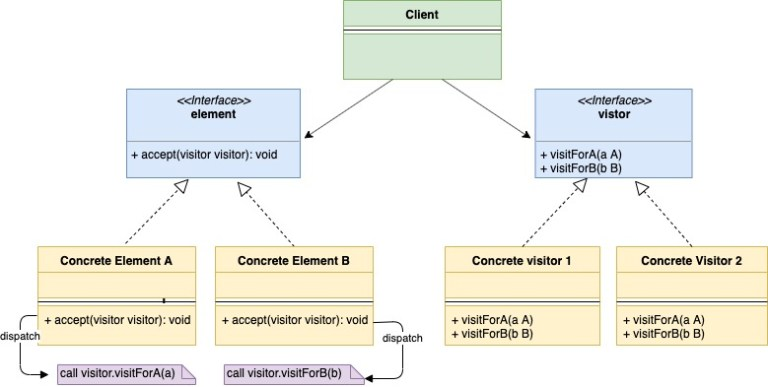
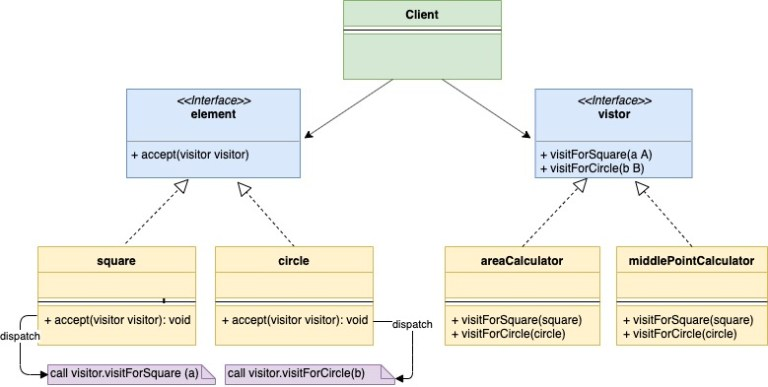

الگو Visitor...

## 9.3.10.1 مقدمه:

الگوی طراحی Visitor یک الگوی طراحی Behavioural است که به شما امکان می‌دهد بدون تغییر در ساختار برنامه، رفتاری را به ساختار آن اضافه کنید.  
بیایید الگوی Visitor را با یک مثال درک کنیم. فرض کنید شما نگهدارنده(maintainer) یک lib هستید که ساختارهای با شکل‌های متفاوتی دارد مانند:

1. Square
2. Circle
3. Triangle

هر یک از ساختارهای شکل بالا یک شکل رابط مشترک را پیاده سازی می کند. تیم های زیادی در شرکت شما وجود دارند که از lib شما استفاده می کنند. حال فرض کنید یکی از تیم از شما می خواهد که یک رفتار دیگر (getArea()) به ساختارهای Shape اضافه کنید. در نتیجه گزینه های زیادی برای حل این مشکل وجود دارد.

#### راه حل اول:

اولین گزینه ای که به ذهن می رسد اضافه کردن متد getArea() در interface  مربوط به **shape** است و سپس هر ساختار **shape** می تواند متد getArea() را پیاده سازی کند. این به نظر بی اهمیت می رسد اما برخی از مشکلات وجود دارد:

*  به عنوان maintainer کتابخانه، نمی خواهید کد بسیار آزمایش شده کتابخانه خود را با افزودن رفتارهای اضافی تغییر دهید.
* ممکن است تیم هایی که از کتابخانه شما استفاده می کنند درخواست بیشتری برای رفتارهای بیشتری مانند getNumSides()، getMiddleCoordinates(). سپس، در این مورد، شما نمی خواهید به اصلاح کتابخانه خود ادامه دهید. اما شما می خواهید که تیم های دیگر کتابخانه شما را بدون تغییر واقعی کد گسترش دهند.

#### راه حل دوم:

گزینه دوم این است که تیمی که این ویژگی را درخواست می کند می تواند منطق رفتار را خودش بنویسد. بنابراین بر اساس نوع shape struct آنها کد زیر را در نظر دارند:


 ```go
if shape.type == square {
   //Calculate area for squre
} elseif shape.type == circle {
    //Calculate area of triangle 
} elseif shape.type == "triangle" {
    //Calculate area of triangle
} else {
   //Raise error
}
```

کد بالا نیز مشکل ساز است زیرا نمی توانید از مزایای کامل interface ها استفاده کنید و به جای آن یک بررسی explicit type که شکننده(fragile) است انجام دهید. دوم، دریافت type در زمان اجرا ممکن است تأثیری بر عملکرد داشته باشد یا حتی در برخی از زبان ها امکان پذیر نباشد.


#### راه حل سوم:

گزینه سوم حل مشکل فوق با استفاده از الگوی visitor است. ما یکvisitor interface را مانند زیر تعریف می کنیم.

```go
type visitor interface {
   visitForSquare(square)
   visitForCircle(circle)
   visitForTriangle(triangle)
}
```

توابع visitforSquare(**square**)، visitForCircle(**circle**)، visitForTriangle(**triangle**) به ما اجازه می دهد تا به ترتیب قابلیت های Square، Circle و Triangle را اضافه کنیم.

حال سوالی که به ذهن می رسد این است که چرا نمی توانیم یک روش visit**(shape)** واحد در visitor interface داشته باشیم. دلیل اینکه ما این ویژگی را نداریم این است که GO و همچنین برخی از زبان های دیگر از method overloading پشتیبانی می کنند. بنابراین یک method متفاوت برای هر یک از ساختارها مورد نیاز است.

ما یک **accept** method را با signature زیر به shape interface اضافه می کنیم و هر یک از shape struct باید این متد را تعریف کنند.

```go
func accept(v visitor)
```

اما یک لحظه صبر کنید، ما فقط اشاره کردیم که نمی خواهیم shape structs موجود خود را تغییر دهیم. اما هنگام استفاده از Visitor Pattern باید shape structs خود را تغییر دهیم اما این اصلاح فقط یک بار انجام می شود. در صورت اضافه کردن هر رفتار اضافی مانند getNumSides()، getMiddleCoordinates() از همان تابع accept(v visitor) فوق بدون تغییر بیشتر در shape structs استفاده می کند. اساساً shape structs فقط باید یک بار اصلاح شوند و تمام درخواست‌های آتی رفتارهای اضافی با استفاده از همان تابع پذیرش بررسی می‌شوند. ببینیم چطور!
ساختار مربع (square struct) یک accept method مانند زیر را اجرا می کند:

```go
func (obj *squre) accept(v visitor){
    v.visitForSquare(obj)
}
```

و به طور مشابه، دایره و مثلث نیز accept function را مانند بالا تعریف می کنند.

اکنون تیمی که رفتار getArea() را درخواست می‌کند، می‌تواند به سادگی concrete implementation را برای  visitor interface را تعریف کند و منطق محاسبه ناحیه را در آن concrete implementation بنویسد.

**areaCalculator.go**

```go
type areaCalculator struct{
    area int
}

func (a *areaCalculator) visitForSquare(s *square){
    //Calculate are for square
}
func (a *areaCalculator) visitForCircle(s *square){
    //Calculate are for circle
}
func (a *areaCalculator) visitForTriangle(s *square){
    //Calculate are for triangle
```

برای محاسبه مساحت یک مربع، ابتدا نمونه ای از مربعی که آنها به سادگی می توانند فراخوانی کنند ایجاد می کنیم.

```go
sq := &square{}
ac := &areaCalculator{}
sq.accept(ac)
```

به طور مشابه، تیم دیگری که برای رفتار getMiddleCoordinates() درخواست می‌کند، می‌تواند پیاده‌سازی concrete دیگری از  visitor interfaceمشابه با بالا تعریف کند.

**middleCoordinates.go**

```go
type middleCoordinates struct {
    x int
    y int
}

func (a *middleCoordinates) visitForSquare(s *square) {
    //Calculate middle point coordinates for square. After calculating the area assign in to the x and y instance variable.
}

func (a *middleCoordinates) visitForCircle(c *circle) {
    //Calculate middle point coordinates for square. After calculating the area assign in to the x and y instance variable.
}

func (a *middleCoordinates) visitForTriangle(t *triangle) {
    //Calculate middle point coordinates for square. After calculating the area assign in to the x and y instance variable.
}
```

 

در زیر نمودار mapping UML متناظر با مثال عملی shape struct و areaCalculator که در بالا ارائه کردیم آمده است.



## 9.3.10.2 # **Mapping**:

جدول زیر mapping از اجزای مهم نمودار UML به اجزای واقعی implementation را در 'مثال' زیر نشان می دهد.


|   |   |
|---|---|
|element|shape.go|
|Concrete Element A|square.go|
|Concrete Element B|circle.go|
|Concrete Element C|rectangle.go|
|Visitor|visitor.go|
|Concrete Visitor 1|areaCalculator.go|
|Concrete Visitor 2|middleCoordinates.go|
|Client|main.go|


## 9.3.10.3 # **مثال**:

**shape.go**

```go
package main

type shape interface {
    getType() string
    accept(visitor)
}
```

**square.go**

```go
package main

type square struct {
    side int
}

func (s *square) accept(v visitor) {
    v.visitForSquare(s)
}

func (s *square) getType() string {
    return "Square"
}
```

**circle.go**

```go
package main

type circle struct {
    radius int
}

func (c *circle) accept(v visitor) {
    v.visitForCircle(c)
}

func (c *circle) getType() string {
    return "Circle"
}
```

**rectangle.go**

```go
package main

type rectangle struct {
    l int
    b int
}

func (t *rectangle) accept(v visitor) {
    v.visitForrectangle(t)
}

func (t *rectangle) getType() string {
    return "rectangle"
}
```

**visitor.go**

```go
package main

type visitor interface {
    visitForSquare(*square)
    visitForCircle(*circle)
    visitForrectangle(*rectangle)
}
```

**areaCalculator.go**

```go
package main

import (
    "fmt"
)

type areaCalculator struct {
    area int
}

func (a *areaCalculator) visitForSquare(s *square) {
    //Calculate area for square. After calculating the area assign in to the area instance variable
    fmt.Println("Calculating area for square")
}

func (a *areaCalculator) visitForCircle(s *circle) {
    //Calculate are for circle. After calculating the area assign in to the area instance variable
    fmt.Println("Calculating area for circle")
}

func (a *areaCalculator) visitForrectangle(s *rectangle) {
    //Calculate are for rectangle. After calculating the area assign in to the area instance variable
    fmt.Println("Calculating area for rectangle")
}
```

**middleCoordinates.go**

```go
package main

import "fmt"

type middleCoordinates struct {
    x int
    y int
}

func (a *middleCoordinates) visitForSquare(s *square) {
    //Calculate middle point coordinates for square. After calculating the area assign in to the x and y instance variable.
    fmt.Println("Calculating middle point coordinates for square")
}

func (a *middleCoordinates) visitForCircle(c *circle) {
    //Calculate middle point coordinates for square. After calculating the area assign in to the x and y instance variable.
    fmt.Println("Calculating middle point coordinates for circle")
}

func (a *middleCoordinates) visitForrectangle(t *rectangle) {
    //Calculate middle point coordinates for square. After calculating the area assign in to the x and y instance variable.
    fmt.Println("Calculating middle point coordinates for rectangle")
}
```

**main.go**

```go
package main

import "fmt"

func main() {
    square := &square{side: 2}
    circle := &circle{radius: 3}
    rectangle := &rectangle{l: 2, b: 3}
   
    areaCalculator := &areaCalculator{}
    square.accept(areaCalculator)
    circle.accept(areaCalculator)
    rectangle.accept(areaCalculator)
   
    fmt.Println()
    middleCoordinates := &middleCoordinates{}
    square.accept(middleCoordinates)
    circle.accept(middleCoordinates)
    rectangle.accept(middleCoordinates)
}
```

**Output:**

```go
Calculating area for square
Calculating area for circle
Calculating area for rectangle

Calculating middle point coordinates for square
Calculating middle point coordinates for circle
Calculating middle point coordinates for rectangle
```

## 9.3.10.3 # **پیاده سازی به صورت یک جا**:


```go
package main

import "fmt"

type shape interface {
    getType() string
    accept(visitor)
}

type square struct {
    side int
}

func (s *square) accept(v visitor) {
    v.visitForSquare(s)
}

func (s *square) getType() string {
    return "Square"
}

type circle struct {
    radius int
}

func (c *circle) accept(v visitor) {
    v.visitForCircle(c)
}

func (c *circle) getType() string {
    return "Circle"
}

type rectangle struct {
    l int
    b int
}

func (t *rectangle) accept(v visitor) {
    v.visitForrectangle(t)
}

func (t *rectangle) getType() string {
    return "rectangle"
}

type visitor interface {
    visitForSquare(*square)
    visitForCircle(*circle)
    visitForrectangle(*rectangle)
}

type areaCalculator struct {
    area int
}

func (a *areaCalculator) visitForSquare(s *square) {
    //Calculate area for square. After calculating the area assign in to the area instance variable
    fmt.Println("Calculating area for square")
}

func (a *areaCalculator) visitForCircle(s *circle) {
    //Calculate are for circle. After calculating the area assign in to the area instance variable
    fmt.Println("Calculating area for circle")
}

func (a *areaCalculator) visitForrectangle(s *rectangle) {
    //Calculate are for rectangle. After calculating the area assign in to the area instance variable
    fmt.Println("Calculating area for rectangle")
}

type middleCoordinates struct {
    x int
    y int
}

func (a *middleCoordinates) visitForSquare(s *square) {
    //Calculate middle point coordinates for square. After calculating the area assign in to the x and y instance variable.
    fmt.Println("Calculating middle point coordinates for square")
}

func (a *middleCoordinates) visitForCircle(c *circle) {
    //Calculate middle point coordinates for square. After calculating the area assign in to the x and y instance variable.
    fmt.Println("Calculating middle point coordinates for circle")
}

func (a *middleCoordinates) visitForrectangle(t *rectangle) {
    //Calculate middle point coordinates for square. After calculating the area assign in to the x and y instance variable.
    fmt.Println("Calculating middle point coordinates for rectangle")
}

func main() {
    square := &square{side: 2}
    circle := &circle{radius: 3}
    rectangle := &rectangle{l: 2, b: 3}
    areaCalculator := &areaCalculator{}
    square.accept(areaCalculator)
    circle.accept(areaCalculator)
    rectangle.accept(areaCalculator)
    
    fmt.Println()
    middleCoordinates := &middleCoordinates{}
    square.accept(middleCoordinates)
    circle.accept(middleCoordinates)
    rectangle.accept(middleCoordinates)
}
```


**Output:**

```go
Calculating area for square
Calculating area for circle
Calculating area for rectangle

Calculating middle point coordinates for square
Calculating middle point coordinates for circle
Calculating middle point coordinates for rectangle
```
