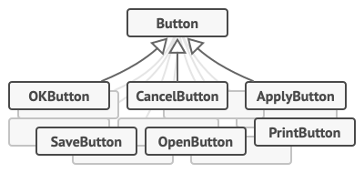
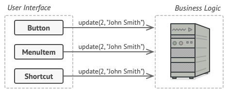
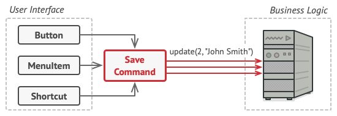
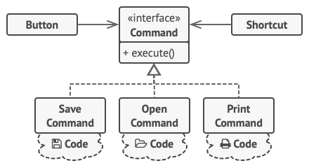

## 9.3.2.1-الگوی طراحی فرمان (Command)

الگوی طراحی Command یک الگوی رفتاری است که یک درخواست را به یک شیء(object) مستقل تبدیل می کند که حاوی تمام اطلاعات مربوط به درخواست است. این تغییر شکل به شما امکان می دهد درخواست‌ها را به عنوان آرگومان متد ارسال کنید و اجرای یک درخواست را به تعویق بیندازید یا در صف قرار دهید و از عملیات قابل لغو پشتیبانی کنید.

## 9.3.2.2-مشکل

فرض کنید روی یک برنامه ویرایشگر متن جدید کار می‌کنید. وظیفه فعلی شما ایجاد نوار ابزار با تعدادی دکمه برای عملیات مختلف ویرایشگر است. شما یک کلاس Button بسیار مرتب ایجاد کرده اید که می‌توان از آن برای دکمه های روی نوار ابزار و همچنین برای دکمه های عمومی در گفتگوهای مختلف استفاده کرد.


## 9.3.2.3-راه‌حل نادرست و مشکلات آن

در حالی که همه این دکمه ها شبیه به هم به نظر می رسند، همه آنها قرار است کارهای متفاوتی انجام دهند. کد مربوط به هندلرهای کلیک های مختلف این دکمه ها را کجا قرار می دهید؟ ساده ترین راه حل ایجاد انبوهی از زیرمجموعه‌ها برای هر مکانی است که دکمه در آن استفاده می شود. این زیرمجموعه ها حاوی کدهایی هستند که باید در صورت کلیک روی دکمه اجرا شوند.



چندان طول نمی کشد که متوجه می شوید این رویکرد عمیقا معیوب است. اول اینکه شما تعداد زیادی از زیرمجموعه‌ها دارید و این خوب است، مگر اینکه هر بار که کلاس Button پایه را تغییر می دهید، خطر شکستن کد در این زیرمجموعه‌ها را نداشته باشید. به بیان ساده، کد رابط کاربری گرافیکی شما به طرز نامناسبی به کد ناپایدار منطق تجاری وابسته شده است.


و حالا بدترین قسمت مربوط به برخی از عملیات‌ها مثل،  کپی/پیست کردن متن، باید از چندین مکان فراخوانی شوند. به عنوان مثال، کاربر می تواند روی دکمه "کپی" کوچک در نوار ابزار کلیک کند یا چیزی را از طریق منوی زمینه کپی کند یا فقط کلیدهای `Ctrl+C` را روی صفحه کلید فشار دهد.

در ابتدا، زمانی که برنامه ما فقط نوار ابزار را داشت، قرار دادن اجرای عملیات مختلف در زیرمجموعه‌های دکمه اشکالی نداشت. به عبارت دیگر، داشتن کد کپی متن داخل زیرمجموعه `CopyButton` خوب بود. اما پس از آن، زمانی که منوها، میانبرها و سایر موارد را پیاده سازی می کنید، باید کد عملیات را در بسیاری از کلاس ها تکرار کنید یا منوها را به دکمه‌ها وابسته کنید، که این کار گزینه‌ای بدتر است.


## 9.3.2.4-راه‌حل

طراحی خوب نرم‌افزار اغلب بر اساس اصل جداسازی دغدغه‌ها (_principle of separation of concerns_) بنا شده است، که معمولاً منجر به شکستن یک برنامه به لایه‌های مختلفی می‌شود. رایج ترین مثال: یک لایه برای رابط کاربری گرافیکی و یک لایه دیگر برای منطق تجاری. لایه GUI مسئول ارائه یک تصویر زیبا روی صفحه، گرفتن هر ورودی و نشان دادن نتایج کارهایی است که کاربر و برنامه انجام می دهند. با این حال، زمانی که نوبت به انجام کار مهمی مانند محاسبه مسیر ماه یا نوشتن گزارش سالانه می رسد، لایه GUI کار را به لایه زیرین منطق تجاری واگذار می‌کند.



در کد ممکن است به این شکل به نظر برسد: یک شیء GUI متدی از یک شیء منطق تجاری را فراخوانی می‌کند و برخی استدلال‌ها را برای آن ارسال می‌کند. این فرآیند معمولاً به عنوان فرستادن یک درخواست از یک شیء به شیء دیگر توصیف می شود.

الگوی command پیشنهاد می کند که اشیاء GUI نباید این درخواست ها را مستقیماً ارسال کنند. در عوض، شما باید تمام جزئیات درخواست، مانند شیء فراخوانده شده، نام متد و لیست آرگومان‌ها را به یک کلاس فرمان جداگانه با یک متد واحد که این درخواست را فعال می کند را استخراج کنید.

اشیاء فرمان به عنوان پیوندهایی بین اشیاء مختلف رابط کاربری و منطق تجاری عمل می کنند. از این به بعد، شیء GUI نیازی به دانستن اینکه کدام شیء منطق تجاری درخواست را دریافت خواهد کرد و چگونه پردازش خواهد شد، ندارد. شیء GUI فقط فرمان را فعال می‌کند، که تمام جزئیات را مدیریت می‌کند.





گام بعدی این است که دستورات خود را برای پیاده سازی همان رابط کاربری وادار کنید. به طور معمول، فقط یک متد اجرایی دارد که هیچ پارامتری را نمی پذیرد. این رابط به شما امکان می دهد از دستورات مختلف با همان فرستنده درخواست استفاده کنید، بدون اینکه آن را به concrete کلاس‌های مشخص دستورات پیوند دهید. به عنوان یک امتیاز، اکنون می توانید اشیاء فرمان مرتبط با فرستنده را جابجا کنید و به طور موثر رفتار فرستنده را در زمان اجرا تغییر دهید.

شاید به یک قطعه گمشده از پازل که پارامترهای درخواست است توجه کرده باشید. یک شیء GUI ممکن است برخی از پارامترها را به شیء لایه تجاری ارائه کرده باشد. از آنجایی که متد اجرای دستور هیچ پارامتری ندارد، چگونه جزئیات درخواست را به گیرنده منتقل کنیم؟ به نظر می رسد که دستور باید از قبل با این داده ها پیکربندی شده باشد، یا قادر به دریافت آن به تنهایی باشد.





حالا که الگوی command را اعمال کرده‌ایم، دیگر به تمام آن زیرمجموعه‌های دکمه برای پیاده‌سازی رفتارهای مختلف کلیک نیاز نداریم. کافی است یک فیلد واحد در کلاس پایه `Button` قرار دهیم که مرجعی به یک شیء فرمان را ذخیره کند و دکمه را وادار کنیم تا آن فرمان را با یک کلیک اجرا کند.

شما مجموعه‌ای از کلاس‌های فرمان را برای هر عملیاتی که ممکن است، پیاده‌سازی خواهید کرد و آن‌ها را با دکمه‌های خاص، بسته به رفتار مورد نظر دکمه‌ها، مرتبط می‌کنید.

سایر عناصر رابط کاربری گرافیکی، مانند منوها، میانبرها یا کل کادرهای محاوره‌ای، می‌توانند به همین روش پیاده‌سازی شوند. آنها به یک فرمان مرتبط می شوند که هنگام تعامل کاربر با عنصر رابط کاربری اجرا می‌شود. همانطور که احتمالاً تا به حال حدس زده اید، عناصر مرتبط با عملیات مشابه به دستورات مشابه مرتبط می‌شوند و از تکرار هر گونه کد جلوگیری می‌کنند.

در نتیجه، دستورات به یک لایه میانی مناسب تبدیل می شوند که وابستگی بین لایه های رابط کاربری و منطق تجاری را کاهش می‌دهد. و این تنها بخشی از مزایایی است که الگوی فرمان می تواند ارائه دهد!

## 9.3.2.5-مثال از دنیای واقعی


بعد از یک پیاده روی طولانی در شهر، به یک رستوران خوب می‌رسید و پشت میز کنار پنجره می‌نشینید. یک پیشخدمت خوش برخورد به سراغ شما می‌آید و به سرعت سفارش شما را می‌گیرد و آن را روی یک تکه کاغذ یادداشت می‌کند. پیشخدمت به آشپزخانه می رود و سفارش را روی دیوار می‌چسباند. پس از مدتی، سفارش به دست سرآشپز می‌رسد، او آن را می‌خواند و غذا را بر اساس آن طبخ می‌دهد. آشپز غذا را به همراه سفارش روی سینی قرار می‌دهد. پیشخدمت سینی را کشف می‌کند، سفارش را بررسی می‌کند تا مطمئن شود همه چیز مطابق میل شماست و همه چیز را سر میز شما می آورد.

سفارش کاغذی به عنوان یک فرمان عمل می کند. تا زمانی که سرآشپز آماده سرو آن نباشد، در صف باقی می ماند. سفارش حاوی تمام اطلاعات مرتبط مورد نیاز برای پخت غذا است. این به سرآشپز اجازه می‌دهد بدون اینکه به طور مستقیم برای دریافت جزئیات سفارش از شما بپرسد، بلافاصله شروع به پخت و پز کند. 


## 9.3.2.6- مثال

####s اجزای اصلی در الگوی طراحی فرمان

اجزای اصلی که در الگوی طراحی فرمان استفاده می شوند عبارتند از:

- گیرنده (Receiver) - کلاسی است که حاوی منطق تجاری است. شیء فرمان فقط درخواست های خود را به گیرنده به تعویق می اندازد.
- فرمان (Command) - گیرنده را جاسازی می‌کند و یک عمل خاص از گیرنده را متصل می کند.
- اجراکننده (Invoker) - فرمان را جاسازی (embed) می‌کند و با فراخوانی متد اجرای فرمان، فرمان را فراخوانی می کند.
- کاربر (Client) - فرمان را با گیرنده مناسب ایجاد می‌کند و گیرنده را از سازنده فرمان دور می زند. پس از آن، همچنین فرمان حاصل را با یک اجراکننده مرتبط می‌کند.

بیایید وضعیتی را درک کنیم که پس از آن مشخص خواهد شد که چرا الگوی فرمان مفید است. 
حالت یک تلویزیون را در نظر بگیرید. تلویزیون را می توان با موارد زیر روشن کرد:

- دکمه روشن کنترل از راه دور
- دکمه روشن روی تلویزیون

هر دوی این نقاط شروع کار یکسانی انجام می دهند یعنی روشن کردن تلویزیون. برای روشن کردن تلویزیون، می توانیم شیء فرمان روشن را با گیرنده به عنوان تلویزیون پیاده سازی کنیم. هنگامی که متد `execute()` روی این شیء فرمان روشن فراخوانده می شود، به نوبه خود تابع `TV.on()` را فراخوانی می کند. بنابراین در این مورد:

- گیرنده تلویزیون است
- فرمان مورد نظر برابر با **command object** روشن است که تلویزیون را جاسازی می‌کند.
- اجراکننده دکمه روشن کنترل از راه دور یا دکمه روشن تلویزیون است. هر دو شیء فرمان روشن را جاسازی می کنند.

در اینجا توجه داشته باشید که ما درخواست روشن کردن تلویزیون را در یک شیء فرمان ( **command object**) روشن که توسط چندین اجراکننده قابل فراخوانی است، بسته بندی کرده‌ایم. این شیء فرمان روشن گیرنده (در اینجا تلویزیون) را جاسازی می‌کند و می‌تواند به طور مستقل اجرا شود.

به عنوان مثال دیگری، مورد یک برنامه ادوبی فتوشاپ را در نظر بگیرید. در فتوشاپ، یک عملیات ذخیره را می توان از 3 مکان راه اندازی کرد:

- از منو
- از دکمه روی نوار بالا
- با استفاده از میانبر Ctrl+S

هر سه نقطه شروع کار یکسانی انجام می دهند، یعنی ذخیره تصویر فعلی در برنامه. این ذخیره را می توان در یک شیء فرمان ذخیره با تصویر فعلی باز در برنامه به عنوان گیرنده، قرار داد.

مزایای ایجاد یک شیء فرمان جداگانه در مثالهای بالا چیست:

- منطق رابط کاربری را از منطق تجاری زیربنایی جدا می‌کند.
- نیاز به ایجاد هندلرهای مختلف برای هر یک از اجراکننده ها نیست.
- شیء فرمان حاوی تمام اطلاعات مورد نیاز برای اجرا است. از این رو می توان از آن برای اجرای به تعویق افتاده نیز استفاده کرد.

**حالا به نمودار UML نگاه کنیم.**

**نمودار UML:**

- توجه کنید که چگونه اجراکننده فرمان را جاسازی می‌کند. درخواست به اجراکننده ارسال می شود و آن درخواست را به شیء فرمان کپسوله شده منتقل می کند.
- تمام اشیاء فرمان Concrete گیرنده را جاسازی می کنند.

**نگاشت**

جدول زیر نگاشت بازیگران نمودار UML را به بازیگران پیاده سازی واقعی در "مثال عملی" در زیر نشان می دهد.

|   |   |
|---|---|
|Invoker|button.go|
|Command Interface|command.go|
|Concrete Command 1|onCommand.go|
|Concrete Command 2|offCommand.go|
|Receiver Interface|device.go|
|Concrete Receiver|tv.go|
|Client|main.go|


## 9.3.2.7-پیاده سازی

**button.go**

```go
package main

type button struct {
    command command
}

func (b *button) press() {
    b.command.execute()
}
```

**command.go**

```go
package main

type command interface {
    execute()
}
```

**onCommand.go**

```go
package main

type onCommand struct {
    device device
}

func (c *onCommand) execute() {
    c.device.on()
}
```

**offCommand.go**

```go
package main

type offCommand struct {
    device device
}

func (c *offCommand) execute() {
    c.device.off()
}
```

**device.go**

```go
package main

type device interface {
    on()
    off()
}
```

**tv.go**

```go
package main

import "fmt"

type tv struct {
    isRunning bool
}

func (t *tv) on() {
    t.isRunning = true
    fmt.Println("Turning tv on")
}

func (t *tv) off() {
    t.isRunning = false
    fmt.Println("Turning tv off")
}
```

**main.go**

```go
package main

func main() {
    tv := &tv{}
    onCommand := &onCommand{
        device: tv,
    }
    offCommand := &offCommand{
        device: tv,
    }
    onButton := &button{
        command: onCommand,
    }
    onButton.press()
    offButton := &button{
        command: offCommand,
    }
    offButton.press()
}
```

**Output:**

```go
Turning tv on
Turning tv off
```

## **Full Working Code:**

```go
package main

import "fmt"

type button struct {
    command command
}

func (b *button) press() {
    b.command.execute()
}

type command interface {
    execute()
}

type offCommand struct {
    device device
}

func (c *offCommand) execute() {
    c.device.off()
}

type onCommand struct {
    device device
}

func (c *onCommand) execute() {
    c.device.on()
}

type device interface {
    on()
    off()
}

type tv struct {
    isRunning bool
}

func (t *tv) on() {
    t.isRunning = true
    fmt.Println("Turning tv on")
}

func (t *tv) off() {
    t.isRunning = false
    fmt.Println("Turning tv off")
}

func main() {
    tv := &tv{}
    onCommand := &onCommand{
        device: tv,
    }
    offCommand := &offCommand{
        device: tv,
    }
    onButton := &button{
        command: onCommand,
    }
    onButton.press()
    offButton := &button{
        command: offCommand,
    }
    offButton.press()
}
```

**Output:**

```go
Turning tv on
Turning tv off
```

