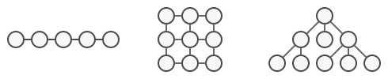

## 9.3.3.1-هدف

الگوي طراحی تکرارکننده (Iterator) یک الگوی رفتاری است که به شما امکان می دهد عناصر یک مجموعه را بدون نمایش ساختار درونی آن (فهرست، پشته، درخت و غیره) پیمایش کنید.

## 9.3.3.2-مشکل

مجموعه ها (collections) یکی از پرکاربردترین انواع داده در برنامه نویسی هستند. با این وجود، یک مجموعه فقط یک ظرف برای گروهی از اشیاء است.


(انواع مختلف از collections)

اکثر مجموعه ها عناصر خود را در لیست های ساده ذخیره می کنند. با این حال، برخی از آنها بر اساس پشته‌ها، درختان، نمودارها و سایر ساختارهای داده پیچیده ساخته شده‌اند.

اما مهم نیست که یک مجموعه چگونه ساختار یافته باشد، باید روشی برای دسترسی به عناصر آن ارائه دهد تا کدهای دیگر بتوانند از این عناصر استفاده کنند. باید راهی برای مرور هر عنصر از مجموعه بدون دسترسی مکرر به عناصر مشابه وجود داشته باشد.

اگر مجموعه ای مبتنی بر لیست دارید، این کار ممکن است آسان به نظر برسد. شما فقط روی تمام عناصر حلقه می زنید. اما چگونه عناصر یک ساختار داده پیچیده مانند درخت را به طور متوالی طی کنید؟ به عنوان مثال، ممکن است یک روز فقط با پیمایش عمق اول (depth-first) یک درخت مشکلی نداشته باشید. اما روز بعد ممکن است به پیمایش عرض اول (breadth-first) نیاز داشته باشید. و هفته بعد، ممکن است به چیز دیگری مانند دسترسی تصادفی به عناصر درخت نیاز داشته باشید.


(از یک مجموعه می‌توان به چند روش مختلف عبور کرد.)

افزودن الگوریتم های پیمایش بیشتر و بیشتر به مجموعه به تدریج مسئولیت اصلی آن که ذخیره کارآمد داده است را تحت الشعاع قرار می دهد. علاوه بر این، برخی الگوریتم‌ها ممکن است برای یک برنامه خاص طراحی شده باشند، بنابراین گنجاندن آنها در یک کلاس عمومی مجموعه عجیب خواهد بود.

از طرف دیگر، کد کلاینت که قرار است با مجموعه‌های مختلفی کار کند، حتی ممکن است اهمیتی ندهد که آنها عناصر خود را چگونه ذخیره می‌کنند. با این حال، از آنجایی که همه مجموعه‌ها روش‌های مختلفی برای دسترسی به عناصر خود ارائه می‌دهند، شما چاره‌ای جز اتصال کد خود به کلاس‌های مجموعه خاص ندارید.

## 9.3.3.3-راه‌حل

ایده اصلی الگوی تکرارکننده (Iterator) این است که رفتار پیمایش یک مجموعه را به یک شیء جداگانه به نام «تکرارکننده» (Iterator) استخراج کند.


(تکرار کننده ها الگوریتم های پیمایش مختلفی را پیاده سازی می کنند. چندین شی تکرارکننده می‌توانند همزمان از یک مجموعه عبور کنند.)


یک شیء تکرارکننده علاوه بر پیاده سازی الگوریتم پیمایش، تمام جزئیات پیمایش مانند موقعیت فعلی و تعداد عناصر باقی مانده تا انتها را دربرمی گیرد. به همین دلیل، چندین تکرارکننده می توانند به طور همزمان و مستقل از یکدیگر، یک مجموعه را طی کنند.

معمولا تکرارکننده‌ها یک روش اصلی برای دریافت عناصر مجموعه ارائه می دهند. کاربر می تواند این روش را تا زمانی که چیزی برنگردد اجرا کند، به این معنی که تکرارکننده تمام عناصر را پیمایش کرده است.

همه تکرارکننده‌ها باید یک رابط مشترک را پیاده سازی کنند. این کار باعث می شود کد کلاینت با هر نوع مجموعه یا هر الگوریتم پیمایشی سازگار باشد، به شرطی که یک تکرارکننده مناسب وجود داشته باشد. اگر به روش خاصی برای پیمایش یک مجموعه نیاز دارید، فقط یک کلاس تکرارکننده جدید بدون نیاز به تغییر مجموعه یا مشتری ایجاد کنید.

## 9.3.3.4-نمونه واقعی


تصمیم می‌گیرید برای چند روز به شهر رم در ایتالیا سفر کنید و از تمام مناظر و جاذبه های اصلی آن دیدن کنید. اما هنگامی که به آنجا رسیدید، ممکن است زمان زیادی را برای قدم زدن در مسیرهای پر پیچ و خم تلف کنید، بدون اینکه حتی بتوانید نماد باستانی مثل کولوسئوم را پیدا کنید.

از طرف دیگر، می توانید یک اپلیکیشن راهنمای مجازی برای گوشی هوشمند خود بخرید و از آن برای مسیریابی استفاده کنید. این کار هوشمند و ارزان است و می توانید تا هر زمان که بخواهید در مکان‌های جالبی توقف و دیدن کنید.

یک راه حل دیگر این است که بخشی از بودجه سفر را صرف استخدام یک راهنمای محلی کنید که شهر را مثل کف دستش بشناسد. راهنما می‌تواند تور را مطابق با سلیقه شما تنظیم کند، هر جاذبه‌ای را به شما نشان دهد و داستان‌های هیجان‌انگیزی تعریف کند. این حتی سرگرم‌کننده‌تر خواهد بود، اما افسوس، گران‌تر هم خواهد بود.

همه این گزینه‌ها - مسیرهای تصادفی که در ذهن شما به وجود می‌آیند، راهنمای هوشمند گوشی هوشمند یا راهنمای انسانی - به عنوان تکرارکننده‌هایی بر روی مجموعه عظیم مناظر و جاذبه‌های واقع در رم عمل می‌کنند.

## 9.3.3.5-مثال 

## الگوی طراحی تکرارکننده (Iterator)

الگوی طراحی تکرارکننده (Iterator) یک الگوی رفتاری است که به شما امکان می دهد عناصر یک مجموعه را بدون نمایش ساختار درونی آن (فهرست، پشته، درخت و غیره) پیمایش کنید.

**اجزای اصلی:**

* **رابط تکرارکننده (Iterator Interface):** این اینترفیس عملیات اصلی برای پیمایش در یک مجموعه را تعریف می کند، به طور معمول شامل روش هایی مانند `hasNext()` برای بررسی وجود عناصر بیشتر و `getNext()` برای بازیابی عنصر بعدی.
* **رابط مجموعه (Collection Interface):** این اینترفیس خود مجموعه را نشان می دهد. ممکن است روشی مانند `createIterator()` را اعلام کند که یک شیء تکرارکننده خاص برای نوع مجموعه را برمی‌گرداند.
* **تکرارکننده خاص (Concrete Iterator):** این کلاسی است که رابط `Iterator` را برای یک نوع مجموعه خاص پیاده سازی می کند. این حالت تکرار (مانند موقعیت فعلی) را حفظ می کند و روش هایی مانند `hasNext()` و `getNext()` را ارائه می دهد که خاص ساختار مجموعه است.
* **مجموعه خاص (Concrete Collection):** این کلاسی است که اینترفیس یا رابط `Collection` را برای یک ساختار داده خاص (مانند لیست، درخت) پیاده سازی می کند. این متد `createIterator()` را ارائه می دهد که یک شیء تکرارکننده خاص را برای پیمایش عناصر آن برمی گرداند.

**مزایا:**

* **جداسازی:** منطق تکرار را از خود مجموعه جدا می کند و اتصالات ضعیف را ارتقا می دهد و کد را انعطاف پذیرتر و قابل استفاده مجدد می کند.
* **چندین پیمایش:** امکان پیمایش همزمان در یک مجموعه با استفاده از تکرارکننده های مختلف، به طور بالقوه با الگوریتم های پیمایش مختلف را فراهم می کند.
* **اصل بسته-باز:** پیاده سازی های جدید تکرارکننده را می توان برای نیازهای مختلف پیمایش بدون تغییر در کلاس های مجموعه اضافه کرد.

با استفاده از تکرارکننده‌‌ها، می توانید کدی بنویسید که با مجموعه های مختلف بدون وابستگی به ساختارهای خاص آنها کار می کند. این امر به ترویج کدی تمیزتر و قابل نگهداری تر کمک می کند.


## 9.3.3.6-**Mapping**

جدول زیر نگاشت بین بازیگران نمودار UML و بازیگران پیاده‌سازی واقعی را در "مثال" زیر نشان می‌دهد:

|   |   |
|---|---|
|Collection|collection.go|
|Concrete Collection|userCollection.go|
|Iterator|mac.go|
|Concrete Iterator 1|userIterator.go|
|Client|main.go|
## 9.3.3.7-پیاده سازی

**collection.go**

```go
package main

type collection interface {
    createIterator() iterator
}
```

**userCollection.go**

```go
package main

type userCollection struct {
    users []*user
}

func (u *userCollection) createIterator() iterator {
    return &userIterator{
        users: u.users,
    }
}
```

**iterator.go**

```go
package main

type iterator interface {
    hasNext() bool
    getNext() *user
}
```

**userIterator.go**

```go
package main

type userIterator struct {
    index int
    users []*user
}

func (u *userIterator) hasNext() bool {
    if u.index < len(u.users) {
        return true
    }
    return false
}

func (u *userIterator) getNext() *user {
    if u.hasNext() {
        user := u.users[u.index]
        u.index++
        return user
    }
    return nil
}
```

**user.go**

```go
package main

type user struct {
    name string
    age  int
}
```

**main.go**

```go
package main

import "fmt"

func main() {
    user1 := &user{
        name: "a",
        age:  30,
    }
    user2 := &user{
        name: "b",
        age:  20,
    }
    userCollection := &userCollection{
        users: []*user{user1, user2},
    }
    iterator := userCollection.createIterator()
    for iterator.hasNext() {
        user := iterator.getNext()
        fmt.Printf("User is %+v\n", user)
    }
}
```

**Output:**

```go
User is &{name:a age:30}
User is &{name:b age:20}
```

# **Full Working Code:**

```go
package main

import "fmt"

type collection interface {
    createIterator() iterator
}

type userCollection struct {
    users []*user
}

func (u *userCollection) createIterator() iterator {
    return &userIterator{
        users: u.users,
    }
}

type iterator interface {
    hasNext() bool
    getNext() *user
}

type userIterator struct {
    index int
    users []*user
}

func (u *userIterator) hasNext() bool {
    if u.index < len(u.users) {
        return true
    }
    return false
}

func (u *userIterator) getNext() *user {
    if u.hasNext() {
        user := u.users[u.index]
        u.index++
        return user
    }
    return nil
}

type user struct {
    name string
    age  int
}

func main() {
    user1 := &user{
        name: "a",
        age:  30,
    }
    user2 := &user{
        name: "b",
        age:  20,
    }
    userCollection := &userCollection{
        users: []*user{user1, user2},
    }
    iterator := userCollection.createIterator()
    for iterator.hasNext() {
        user := iterator.getNext()
        fmt.Printf("User is %+v\n", user)
    }
}
```

**Output:**

```go
User is &{name:a age:30}
User is &{name:b age:20}
```