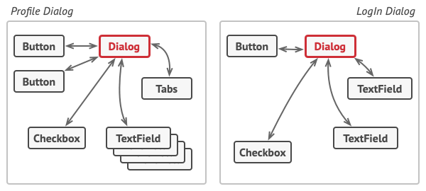
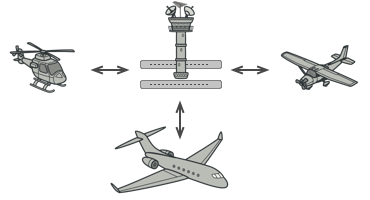

**الگوی طراحی Mediator**

الگوی طراحی واسطه (**Mediator**)، یک الگوی رفتاری است که به شما امکان می‌دهد تا وابستگی‌های درهم‌تنیده بین اشیاء را کاهش دهید. این الگو ارتباط مستقیم بین اشیاء را محدود می‌کند و آن‌ها را مجبور می‌سازد تا تنها از طریق یک شیء واسطه با هم همکاری کنند.

**مشکل**

فرض کنید یک جعبه dialog  برای ایجاد و ویرایش پروفایل کاربران دارید. این جعبه dialog شامل کنترل‌های مختلف فرم مانند فیلدهای متنی، کادرهای انتخابی(checkbox)، دکمه‌ها و غیره می‌شود.

 

ممکن است برخی از عناصر فرم با سایرین تعامل داشته باشند. برای مثال، انتخاب checkbox "من یک سگ دارم" ممکن است یک فیلد متنی پنهان برای وارد کردن نام سگ را نمایش دهد. مثال دیگر دکمه “ثبت” است که باید قبل از ذخیره اطلاعات، صحت مقادیر همه فیلدها را تایید کند.

 

با پیاده‌سازی مستقیم این منطق درون کد عناصر فرم، باعث می‌شوید استفاده‌ی مجدد از کلاس‌های این عناصر در فرم‌های دیگر برنامه بسیار دشوار شود. برای نمونه، به دلیل وابستگی به فیلد متن سگ، نمی‌توانید از کلاس کادر انتخاب مذکور در فرم دیگری استفاده کنید. در این حالت، مجبور هستید یا از تمام کلاس‌های درگیر در نمایش فرم پروفایل استفاده کنید، یا هیچ‌کدام را به کار نبرید.

**راه‌حل**

الگوی طراحی Mediator پیشنهاد می‌کند که تمام ارتباط‌های مستقیم بین اجزایی که می‌خواهید مستقل از یکدیگر باشند را متوقف کنید. در عوض، این اجزا باید به صورت غیرمستقیم با هم همکاری کنند، یعنی با فراخوانی یک شیء واسطه‌ی خاص که تماس‌ها را به اجزای مناسب هدایت می‌کند. در نتیجه، اجزا تنها به یک کلاس واسطه وابسته می‌شوند، نه اینکه به ده‌ها جزء همکار دیگرشان وابسته باشند.

در مثال فرم ویرایش پروفایل، خود کلاس باکس گفتگو می‌تواند نقش واسطه را ایفا کند. به احتمال زیاد، کلاس جعبه dialog از قبل از تمام زیرمجموعه‌هایش آگاه است، بنابراین حتی نیازی به معرفی وابستگی‌های جدید به این کلاس نخواهید داشت.

مهم‌ترین تغییر در عناصر واقعی فرم اتفاق می‌افتد. بیایید دکمه‌ی “ثبت” را در نظر بگیریم. پیش از این، هر بار که کاربر روی دکمه کلیک می‌کرد، این دکمه مجبور بود صحت مقادیر تمام عناصر فرم مجزا را تایید کند. حالا تنها وظیفه‌ی دکمه، اطلاع‌رسانی به باکس گفتگو در مورد کلیک است. باکس گفتگو پس از دریافت این اطلاع‌رسانی، تایید صحت را خودش انجام می‌دهد یا این وظیفه را به عناصر مجزا واگذار می‌کند. بنابراین، به جای وابستگی به ده‌ها عنصر فرم، دکمه تنها به کلاس باکس گفتگو وابسته است.

می‌توانید فراتر بروید و وابستگی را حتی سست‌تر کنید، با این کار که یک واسط مشترک برای تمام انواع جعبه‌های dialog تعریف کنید. این واسط، متد اطلاع‌رسانی را معرفی می‌کند که همه عناصر فرم می‌توانند از آن برای اطلاع‌رسانی به باکس گفتگو در مورد رویدادهای رخ‌داده در آن عناصر استفاده کنند. بنابراین، دکمه‌ی “ثبت” ما حالا باید بتواند با هر باکس گفتگویی که آن واسط را پیاده‌سازی می‌کند، کار کند.

به این ترتیب، الگوی طراحی واسطه به شما امکان می‌دهد تا یک شبکه‌ی پیچیده‌ی روابط بین اشیاء مختلف را درون یک شیء واسطه‌ی واحد کپسوله‌سازی کنید. هرچه وابستگی‌های یک کلاس کمتر باشد، اصلاح، توسعه یا استفاده‌ی مجدد از آن کلاس آسان‌تر می‌شود.

**تشبیه دنیای واقعی**

 

خلبانان هواپیماهایی که به منطقه‌ی کنترل فرودگاه نزدیک می‌شوند یا از آن خارج می‌شوند، به طور مستقیم با یکدیگر ارتباط برقرار نمی‌کنند. در عوض، آن‌ها با یک کنترل‌کننده‌ی ترافیک هوایی صحبت می‌کنند که در یک برج بلند، جایی در نزدیکی باند فرودگاه قرار دارد. بدون وجود کنترل‌کننده ترافیک هوایی، خلبانان باید از هر هواپیمایی در حوالی فرودگاه آگاه باشند و با یک کمیته‌ی متشکل از ده‌ها خلبان دیگر در مورد اولویت‌های فرود بحث کنند. این امر احتمالا آمار سقوط هواپیما را به طرز چشمگیری افزایش می‌داد.

برج نیازی به کنترل کل پرواز ندارد. برج فقط برای اعمال محدودیت‌ها در منطقه‌ی ترمینال وجود دارد، زیرا تعداد بازیگران درگیر در آنجا ممکن است برای خلبان غلبه‌کننده باشد.

https://golangbyexample.com/mediator-design-pattern-golang/
