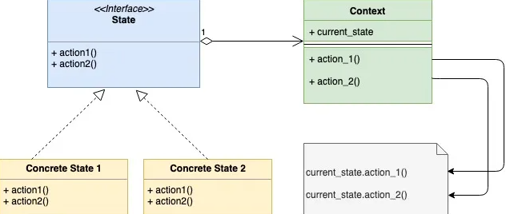

الگو State...

## 9.3.7.1 مقدمه:

دیزاین پترن State یک دیزاین پترن behavioral است که مبتنی بر Finite State Machine است. ما دیزاین پترن State را در زمینه نمونه ای از [Vending Machine](https://en.wikipedia.org/wiki/Vending_machine) توضیح خواهیم داد. برای سادگی، بیایید فرض کنیم که Vending Machine فقط یک نوع کالا یا محصول دارد. همچنین برای سادگی، فرض می کنیم که یک Vending Machine می تواند در 4 حالت(state) مختلف باشد:

1. **hasItem**
2. **noItem**
3. **itemRequested**
4. **hasMoney**

یک Vending Machine خودکار نیز عملکردهای متفاوتی خواهد داشت. دوباره برای سادگی فرض می کنیم که فقط چهار عمل وجود دارد:

1. **Select the item**
2. **Add the item**
3. **Insert Money**
4. **Dispense Item**

## 9.3.7.2 چه زمانی از این الگو استفاده کنیم:

* از الگوی طراحی State زمانی استفاده کنید که **object** می تواند در بسیاری از حالت های (**states**) مختلف باشد. بسته به درخواست فعلی، **object** باید وضعیت فعلی خود را تغییر دهد.
	* در مثال بالا، Vending Machine می تواند در بسیاری از حالت های مختلف باشد. یک Vending Machine از یک state به حالت دیگر تغییر می کند. فرض کنید Vending Machine در مورد **itemRequested** است، پس از انجام عمل «**hasMoney**» به حالت «**Insert Money**» منتقل می‌شود. 
* از این پترن زمانی استفاده کنید که یک شی بسته به وضعیت فعلی پاسخ‌های متفاوتی به درخواست یکسان داشته باشد. استفاده از الگوی طراحی states در اینجا از بسیاری از عبارات شرطی جلوگیری می کند
	*  به عنوان مثال در مورد Vending Machine، اگر کاربری بخواهد کالایی را خریداری کند، اگر آن مورد hasItemState باشد دستگاه ادامه خواهد داد یا اگر در noItemState باشد آن را رد می کند. اگر در اینجا متوجه شدید که Vending Machine خودکار به درخواست خرید یک کالا، بسته به اینکه آیا در hasItemState باشد، دو پاسخ متفاوت می دهد. به فایل vendingMachine.go زیر توجه کنید، هیچ نوع دستور شرطی ندارد. تمام منطق توسط پیاده سازی های concrete state اداره می شود.

## 9.3.7.3 ## **UML Diagram**:
 


## 9.3.7.4 ##  **Mapping**:

جدول زیر mapping از  نمودار UML به نمونه اجرایی پیاده سازی واقعی در کد را نشان می دهد.


|   |   |
|---|---|
|Context|vendingMachine.go|
|State Interface|state.go|
|Concrete State 1|noItemState.go|
|Concrete State 2|hasItemState.go|
|Concrete State 3|itemRequestedState.go|
|Concrete State 4|hasMoneyState.go|


## 9.3.7.5 ##  **توضیحات**:

* ما یک رابط(interface) از نوع 'State' داریم که signature توابع را تعریف می کند که نشان دهنده عملکرد در زمینه Vending Machine است. در زیر signatureهای توابع عملیاتی وجود دارد  
1. addItem(int) error
2. requestItem() error
3. insertMoney(money int) error
4. dispenseItem() error

* هر یک از پیاده‌سازی‌های concrete state، هر 4 تابع بالا را پیاده‌سازی می‌کنند و روی  اقدامات مربوط به هر کدام یا به حالت دیگری می‌روند یا پاسخی تولید می‌کنند.

* هر یک از concrete stateها نیز یک اشاره گر را به object مربوط به Vending Machine فعلی تعبیه(embed) می کند تا انتقال حالت (state transition) در آن object اتفاق بیفتد.

## 9.3.7.6 ##  **مثال کاربردی**:

**vendingMachine.go**

```go
package main

import "fmt"

type vendingMachine struct {
    hasItem       state
    itemRequested state
    hasMoney      state
    noItem        state

    currentState state

    itemCount int
    itemPrice int
}

func newVendingMachine(itemCount, itemPrice int) *vendingMachine {
    v := &vendingMachine{
        itemCount: itemCount,
        itemPrice: itemPrice,
    }
    hasItemState := &hasItemState{
        vendingMachine: v,
    }
    itemRequestedState := &itemRequestedState{
        vendingMachine: v,
    }
    hasMoneyState := &hasMoneyState{
        vendingMachine: v,
    }
    noItemState := &noItemState{
        vendingMachine: v,
    }

    v.setState(hasItemState)
    v.hasItem = hasItemState
    v.itemRequested = itemRequestedState
    v.hasMoney = hasMoneyState
    v.noItem = noItemState
    return v
}

func (v *vendingMachine) requestItem() error {
    return v.currentState.requestItem()
}

func (v *vendingMachine) addItem(count int) error {
    return v.currentState.addItem(count)
}

func (v *vendingMachine) insertMoney(money int) error {
    return v.currentState.insertMoney(money)
}

func (v *vendingMachine) dispenseItem() error {
    return v.currentState.dispenseItem()
}

func (v *vendingMachine) setState(s state) {
    v.currentState = s
}

func (v *vendingMachine) incrementItemCount(count int) {
    fmt.Printf("Adding %d items\n", count)
    v.itemCount = v.itemCount + count
}
```

**state.go**

```go
package main

type state interface {
    addItem(int) error
    requestItem() error
    insertMoney(money int) error
    dispenseItem() error
}
```


**noItemState.go**

```go
package main

import "fmt"

type noItemState struct {
    vendingMachine *vendingMachine
}

func (i *noItemState) requestItem() error {
    return fmt.Errorf("Item out of stock")
}

func (i *noItemState) addItem(count int) error {
    i.vendingMachine.incrementItemCount(count)
    i.vendingMachine.setState(i.vendingMachine.hasItem)
    return nil
}

func (i *noItemState) insertMoney(money int) error {
    return fmt.Errorf("Item out of stock")
}
func (i *noItemState) dispenseItem() error {
    return fmt.Errorf("Item out of stock")
}
```

**hasItemState.go**

```go
package main

import "fmt"

type hasItemState struct {
    vendingMachine *vendingMachine
}

func (i *hasItemState) requestItem() error {
    if i.vendingMachine.itemCount == 0 {
        i.vendingMachine.setState(i.vendingMachine.noItem)
        return fmt.Errorf("No item present")
    }
    fmt.Printf("Item requestd\n")
    i.vendingMachine.setState(i.vendingMachine.itemRequested)
    return nil
}

func (i *hasItemState) addItem(count int) error {
    fmt.Printf("%d items added\n", count)
    i.vendingMachine.incrementItemCount(count)
    return nil
}

func (i *hasItemState) insertMoney(money int) error {
    return fmt.Errorf("Please select item first")
}
func (i *hasItemState) dispenseItem() error {
    return fmt.Errorf("Please select item first")
}
```

**itemRequestedState.go**

```go
package main

import "fmt"

type itemRequestedState struct {
    vendingMachine *vendingMachine
}

func (i *itemRequestedState) requestItem() error {
    return fmt.Errorf("Item already requested")
}

func (i *itemRequestedState) addItem(count int) error {
    return fmt.Errorf("Item Dispense in progress")
}

func (i *itemRequestedState) insertMoney(money int) error {
    if money < i.vendingMachine.itemPrice {
        fmt.Errorf("Inserted money is less. Please insert %d", i.vendingMachine.itemPrice)
    }
    fmt.Println("Money entered is ok")
    i.vendingMachine.setState(i.vendingMachine.hasMoney)
    return nil
}

func (i *itemRequestedState) dispenseItem() error {
    return fmt.Errorf("Please insert money first")
}
```


**hasMoneyState.go**

```go
package main

import "fmt"

type hasMoneyState struct {
    vendingMachine *vendingMachine
}

func (i *hasMoneyState) requestItem() error {
    return fmt.Errorf("Item dispense in progress")
}

func (i *hasMoneyState) addItem(count int) error {
    return fmt.Errorf("Item dispense in progress")
}

func (i *hasMoneyState) insertMoney(money int) error {
    return fmt.Errorf("Item out of stock")
}

func (i *hasMoneyState) dispenseItem() error {
    fmt.Println("Dispensing Item")
    i.vendingMachine.itemCount = i.vendingMachine.itemCount - 1
    if i.vendingMachine.itemCount == 0 {
        i.vendingMachine.setState(i.vendingMachine.noItem)
    } else {
        i.vendingMachine.setState(i.vendingMachine.hasItem)
    }
    return nil
}
```

**main.go**

```go
package main

import (
    "fmt"
    "log"
)

func main() {
    vendingMachine := newVendingMachine(1, 10)
    err := vendingMachine.requestItem()
    if err != nil {
        log.Fatalf(err.Error())
    }
    err = vendingMachine.insertMoney(10)
    if err != nil {
        log.Fatalf(err.Error())
    }
    err = vendingMachine.dispenseItem()
    if err != nil {
        log.Fatalf(err.Error())
    }

    fmt.Println()
    err = vendingMachine.addItem(2)
    if err != nil {
        log.Fatalf(err.Error())
    }

    fmt.Println()

    err = vendingMachine.requestItem()
    if err != nil {
        log.Fatalf(err.Error())
    }

    err = vendingMachine.insertMoney(10)
    if err != nil {
        log.Fatalf(err.Error())
    }

    err = vendingMachine.dispenseItem()
    if err != nil {
        log.Fatalf(err.Error())
    }
}
```


**Output:**

```go
Item requestd
Money entered is ok
Dispensing Item

Adding 2 items

Item requestd
Money entered is ok
Dispensing Item
```


