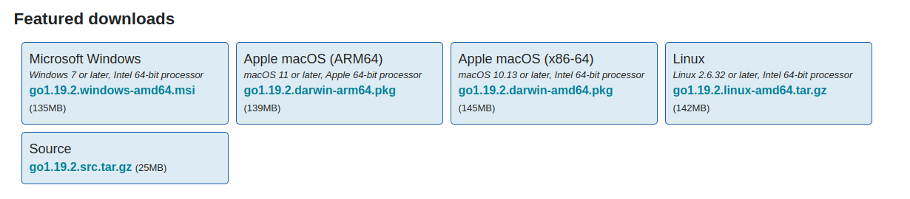

جهت نصب زبان گو بر روی سیستم عامل مورد نظر خود در ابتدا باید نسخه مناسب با پلت‌فرم خود را [دانلود](https://go.dev/dl/) کنید.






1. در [اینجا](https://go.dev/dl/) نسخه مرتبط با لینوکس خود را دانلود کنید.
```shell
$ wget -c https://go.dev/dl/go1.xx.x.linux-amd64.tar.gz
```
2. سپس دستور زیر را بزنید تا اگر نسخه قبلی وجود دارد پاک شود و نسخه جدید در مسیر `usr/local/go/` جایگزین شود.
```shell
$ sudo rm -rf /usr/local/go && sudo tar -C /usr/local -xzf go1.xx.x.linux-amd64.tar.gz
```
3. افزودن مسیر `usr/local/go/bin/` به  
```shell
export PATH=$PATH:/usr/local/go/bin
```


بهتر است برای اینکه هر بار ترمینال را باز می‌کنید و فایل go توسط shell شناخته شود دستور فوق را به فایل `home/{user}/.profile/` اضافه کنید.


4. جهت اطمینان از اینکه زبان گو بدرستی بر روی سیستم عامل شما نصب شده است دستور زیر را داخل ترمینال بزنید.
```shell
$ go version
```



## روش اول
1. در [اینجا](https://go.dev/dl/) نسخه مرتبط با ویندوز خود را دانلود کنید.
2. سپس فایل **go1.xx.x.windows-{arch}.msi** را اجرا کنید.
3. مراحل نصب را بصورت پیش فرض طی کنید تا زبان گو برروی ویندوز نصب شود.
4. پس از نصب، جهت اطمینان از نصب بودن زبان گو، مراحل زیر را انجام دهید:
	-  وارد منو استارت شوید.
	- در منو استارت کلمه **cmd** را جستجو کنید و سپس آن را اجرا کنید.
	- داخل  دستور زیر را بزنید تا از نصب بودن زبان گو اطمینان حاصل فرمایید.

```shell
go version
```

## روش دوم
برای نصب گو می‌توانید از [Chocolatey Package Manager](https://community.chocolatey.org/) استفاده کنید.
1. خط فرمان PowerShell را به صورت Administrator باز کنید و دستور زیر را داخل PowerShell بزنید.

```shell
Set-ExecutionPolicy Bypass -Scope Process -Force; [System.Net.ServicePointManager]::SecurityProtocol = [System.Net.ServicePointManager]::SecurityProtocol -bor 3072; iex ((New-Object System.Net.WebClient).DownloadString('https://community.chocolatey.org/install.ps1'))
```

2. بعد از نصب می‌توانید از دستور choco برای نصب گو استفاده کنید.

```shell
choco install golang
```

3. جهت اطمینان از اینکه زبان گو بدرستی بر روی سیستم عامل شما نصب شده است دستور زیر را داخل ترمینال بزنید.


```shell
$ go version
```


دقت داشته باشید برای نصب برنامه‌های مختلف مثل git و یا ابزارهای دیگر در محیط Administrator باید از دستور choco استفاده کنید.






## روش اول
1. در [اینجا](https://go.dev/dl/) نسخه مرتبط با مکینتاش خود را دانلود کنید.
2. سپس فایل **go1.xx.x.darwin-{arch}.pkg** را اجرا کنید.
3. مراحل نصب را بصورت پیش فرض طی کنید تا زبان گو برروی مکینتاش نصب شود.
4. پس از نصب اگر ترمینال باز بود آن را کامل ببنید تا تغییرات صورت گیرد.
5. جهت اطمینان از اینکه زبان گو بدرستی بر روی سیستم عامل  شما نصب شده است دستور زیر را داخل ترمینال بزنید.

```shell
$ go version
```

## روش دوم
برای نصب گو میتوانید از [Homebrew Package Manager](https://brew.sh/) استفاده کنید. 
1. برای نصب brew می‌توانید ترمینال خود را باز کنید و از دستور زیر استفاده کنید.

```shell
$ /bin/bash -c "$(curl -fsSL https://raw.githubusercontent.com/Homebrew/install/HEAD/install.sh)"
```

2. بعد از نصب brew از دستور زیر برای نصب گو داخل ترمینال استفاده کنید.

```shell
$ brew update && brew install golang
```

3. جهت اطمینان از اینکه زبان گو بدرستی بر روی سیستم عامل شما نصب شده است دستور زیر را داخل ترمینال بزنید.


```shell
$ go version
```




